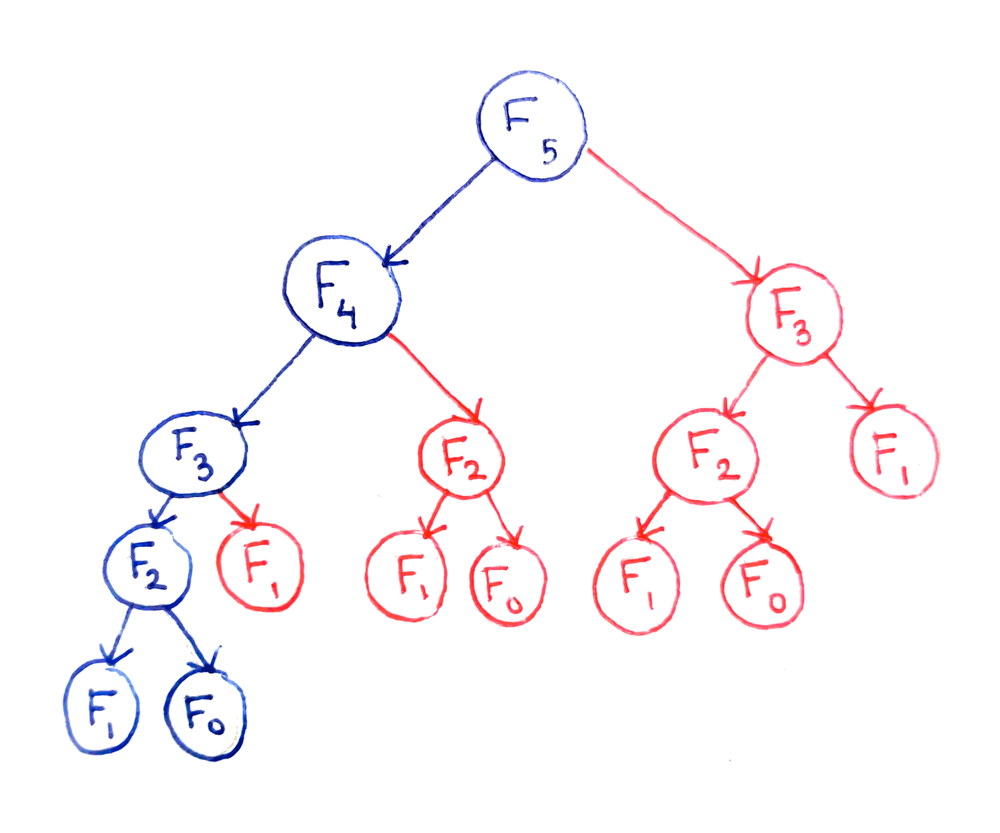
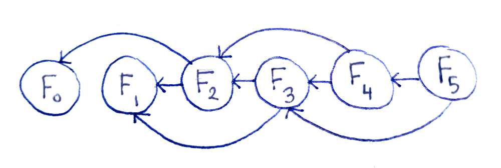

# Dynamic programming

## Info
Фундаментальная проблема заключается в многократном выполнении одинаковых вычислений. 
Например, F3 рассчитывается дважды, а F2 – трижды, хотя результат каждый раз получается одинаковый. 
Даже если не углубляться в анализ времени выполнения, очевидно, что для этого алгоритма оно будет расти по экспоненте.

Например, чтобы вычислить факториал через рекурсию, то при увеличении n с 10 до 20, программа сильно
замедлится. 

На решении подобных проблем и специализируется динамическое программирование. 
Оно помогает решать рекурсивные задачи с сильно перекрывающейся структурой подзадач. 
Это означает, что некоторые действия повторяются снова и снова, с одинаковыми входными данными и результатом.

Не каждая задача пригодна для DP. Если подпроблемы не перекрываются, следует использовать алгоритм "разделяй и властвуй", 
как при сортировке массива слиянием.

## Используем мемоизацию
Один из способов избежать постоянного пересчитывания одних и тех же данных – кешировать результаты вычислений.

Реализация:
- Если кеш содержит результат для полученных входных данных, использовать значение из кеша.
- В противном случае, вычислить результат и сохранить его в кеше, поставив в соответствие с входными данными.

Но что насчет пространственной сложности? Для вычисления Fn нужно вычислить Fn-1 и Fn-2, и так далее до F0. 
Следовательно, придется кэшировать O(n) результатов. Значит, потребуется O(n) памяти.

## Используем динамическое программирование
Простая мемоизация результатов, с которой мы только что имели дело – это классический подход сверху вниз. 
Но можно коварно зайти и с другой стороны.

Взгляните на эту диаграмму, где каждая подзадача показана только один раз. Это цепочка зависимостей задач. 
Если две разные проблемы зависят (базируются) от одной и той же подпроблемы, то на нее будут указывать две стрелки.

Такая точка зрения позволяет сделать сразу несколько важных заключений. Прежде всего, у нас есть O(n) подпроблем. 
Кроме того, эта диаграмма является направленным ациклическим графом (DAG), что означает:
- есть узлы (задачи) и ребра (зависимости между ними);
- ребра имеют направление, одна подзадача зависит от другой;
- нет циклов, значит нельзя начать с одной подзадачи и, следуя по стрелкам, вернуться к ней же.

В направленном ациклическом графе можно упорядочить вершины таким образом, что если пройти через них по очереди, 
вы будете всегда следовать направлению стрелок. Практически это означает, что можно расставить подзадачи таким образом, 
чтобы всегда иметь нужный результат еще до того, как он понадобится в более крупной задаче.

Для ряда Фибоначчи этот порядок соответствует увеличению входных данных. 
То есть сначала мы должны вычислить F0, затем F1, F2 и так далее до Fn.

Формализация алгоритма:
- Заведем две локальные переменные, которые будут представлять последние два числа Фибоначчи, с которыми мы работаем.
- Поместим в них F0(=1) и F1(=1)
- Изменяя i от 2 до n вычислим Fi. Каждая операция зависит только от Fi-1 и Fi-2, которые хранятся в локальных переменных. 
Получая результат, мы выбрасываем Fi-2, заменяем его на Fi-1, а в оставшуюся переменную записываем Fi.