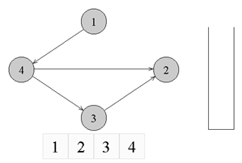

# Topological sort

## Info
Топологическая сортировка (topological sorting) — это упорядочивание вершин в ориентированном ациклическом графе (DAG, Directed Acyclic Graph) таким образом, 
что для каждого ребра (u, v) вершина u предшествует вершине v в этом порядке. Топологическая сортировка возможна только для графов, 
которые не содержат циклов.

адача топологической сортировки графа состоит в следующем: указать такой линейный порядок на его вершинах, 
чтобы любое ребро вело от вершины с меньшим номером к вершине с большим номером. 
Очевидно, что если в графе есть циклы, то такого порядка не существует.

Основная идея топологической сортировки заключается в следующем:
1. Найти вершину, у которой нет входящих ребер (нет зависимостей).
2. Удалить эту вершину и все исходящие из неё ребра.
3. Повторять шаги 1 и 2 до тех пор, пока все вершины не будут обработаны.

Топологическая сортировка может быть реализована с использованием различных алгоритмов, таких как:
Поиск в глубину (DFS):
- Использует рекурсию для обхода графа.
- Помечает вершины как посещенные и добавляет их в список после завершения обхода всех смежных вершин.
- Список, полученный в результате, является топологически отсортированным.

Алгоритм Кана (Kahn's algorithm):
- Использует очередь для хранения вершин без входящих ребер.
- Удаляет вершины из очереди, добавляет их в результирующий список и уменьшает количество входящих ребер для смежных вершин.
- Если после обработки всех вершин остались вершины с входящими ребрами, это означает наличие цикла в графе.

Топологическая сортировка широко применяется в различных областях, таких как управление проектами, распределение задач, 
компиляция программ и других задачах, где требуется определить порядок выполнения действий с учетом зависимостей.