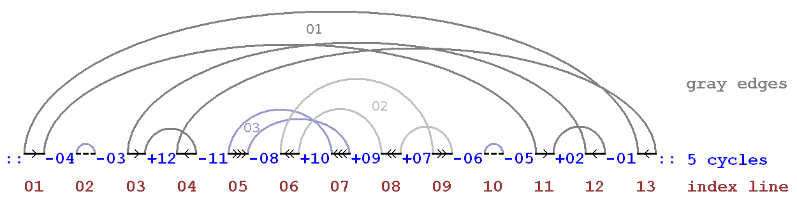

# Сортировка методом "Cycle Sort"

## Что это такое?
Сортировка методом **Cycle Sort** — это алгоритм сортировки, который работает путем перемещения элементов в их правильные позиции с использованием циклов. Алгоритм использует свойство, что каждый элемент, если он не находится на своем месте, должен перемещаться в определенную позицию, что эквивалентно циклическому перемещению элементов.

Процесс работы алгоритма:
1. Проходим по каждому элементу массива, который еще не отсортирован.
2. Для каждого элемента находим его правильную позицию (если бы элементы были отсортированы).
3. Если элемент не находится на правильной позиции, он перемещается на свою позицию, и элементы, которые стояли на этой позиции, перемещаются в нужное место.
4. Повторяем процесс для каждого элемента до тех пор, пока массив не будет отсортирован.

## Временная сложность
- **Лучший, средний и худший случай**: **O(n^2)**. Алгоритм требует двух вложенных циклов для прохождения всех элементов и для нахождения их правильной позиции.

## Пространственная сложность
- Пространственная сложность: **O(1)**. Алгоритм работает "на месте", не требуя дополнительной памяти, кроме временных переменных для хранения индексов и значений.

## Плюсы и минусы

### Плюсы:
- **Минимизация операций записи**: поскольку алгоритм работает "на месте" и минимизирует количество записей в массив, это может быть полезно, когда важна экономия операций записи.
- **Отсутствие необходимости в дополнительной памяти**: алгоритм использует только несколько временных переменных, что делает его экономичным по памяти.

### Минусы:
- **Высокая временная сложность**: алгоритм имеет квадратичную сложность, что делает его медленным на больших массивах данных.
- **Неэффективен для массивов с повторяющимися элементами**: алгоритм может стать неэффективным, если в массиве много одинаковых элементов, так как он все равно будет совершать лишние перемещения.

## Где используется?
- **Используется в памяти с ограниченным доступом для записи**: например, в системах, где минимизация количества записей важна (например, в базе данных с ограниченным числом операций записи).
- **Сортировка в ограниченных условиях**: используется, когда важно минимизировать количество операций записи, а не время выполнения алгоритма.
- **Где элементы находятся в ограниченном диапазоне**: эффективен для определенных типов данных с малым диапазоном значений.

