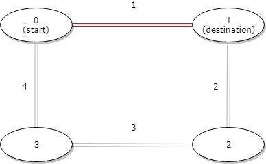
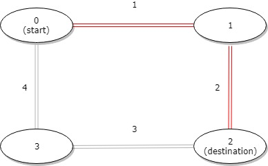
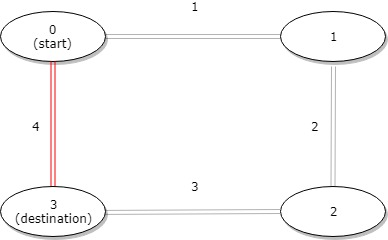

# 1184. Distance Between Bus Stops


## Level - easy


## Task
A bus has n stops numbered from 0 to n - 1 that form a circle. We know the distance between all pairs of neighboring stops where distance[i] is the distance between the stops number i and (i + 1) % n.

The bus goes along both directions i.e. clockwise and counterclockwise.

Return the shortest distance between the given start and destination stops.


## Объяснение
Расстояние между остановками автобуса.
Вам нужно найти минимальное расстояние, которое нужно проехать, чтобы добраться от остановки start до остановки destination.
Автобус может ехать как по часовой стрелке, так и против часовой стрелки по маршруту.

Пример:
- Copy
- distance = [1, 2, 3, 4]
- start = 0

- Если ехать по часовой стрелке: расстояние = distance[0] + distance[1] = 1 + 2 = 3.
- Если ехать против часовой стрелки: расстояние = distance[2] + distance[3] = 3 + 4 = 7.
- Минимальное расстояние = 3.


## Example 1:


```
Input: distance = [1,2,3,4], start = 0, destination = 1
Output: 1
Explanation: Distance between 0 and 1 is 1 or 9, minimum is 1.
```

## Example 2:

```
Input: distance = [1,2,3,4], start = 0, destination = 2
Output: 3
Explanation: Distance between 0 and 2 is 3 or 7, minimum is 3.
```


## Example 3:

```
Input: distance = [1,2,3,4], start = 0, destination = 3
Output: 4
Explanation: Distance between 0 and 3 is 6 or 4, minimum is 4.
```


## Constraints:
- 1 <= n <= 10^4
- distance.length == n
- 0 <= start, destination < n
- 0 <= distance[i] <= 10^4