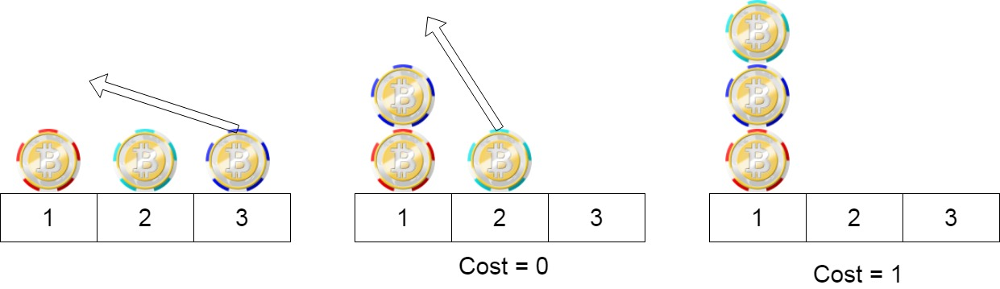
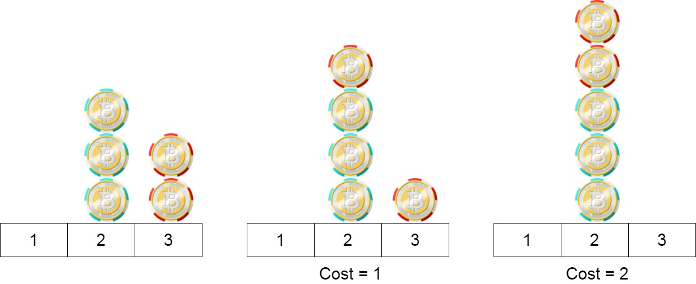

# 1217. Minimum Cost to Move Chips to The Same Position


## Level - easy


## Task
We have n chips, where the position of the ith chip is position[i].

We need to move all the chips to the same position. In one step, we can change the position of the ith chip from position[i] to:

position[i] + 2 or position[i] - 2 with cost = 0.
position[i] + 1 or position[i] - 1 with cost = 1.
Return the minimum cost needed to move all the chips to the same position.


## Объяснение
Дано n фишек, где position[i] - это позиция i-той фишки.

Необходимо переместить все фишки в одну позицию. За один ход можно изменить позицию i-той фишки следующим образом:

- Переместить на 2 позиции вперед или назад (position[i] + 2 или position[i] - 2) с нулевой стоимостью
- Переместить на 1 позицию вперед или назад (position[i] + 1 или position[i] - 1) со стоимостью 1

Нужно найти минимальную стоимость, необходимую для перемещения всех фишек в одну позицию.


## Example 1:

```
Input: position = [1,2,3]
Output: 1
Explanation: First step: Move the chip at position 3 to position 1 with cost = 0.
Second step: Move the chip at position 2 to position 1 with cost = 1.
Total cost is 1.
```

## Example 2:

```
Input: position = [2,2,2,3,3]
Output: 2
Explanation: We can move the two chips at position  3 to position 2. Each move has cost = 1. The total cost = 2.
```

## Example 3:
```
Input: position = [1,1000000000]
Output: 1
```

## Constraints:
- 1 <= position.length <= 100
- 1 <= position[i] <= 10^9