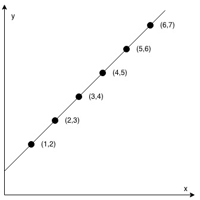
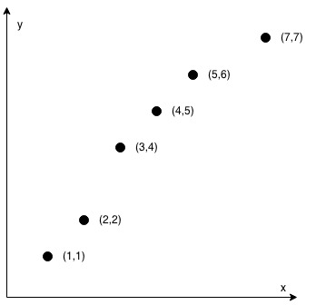

# 1232. Check If It Is a Straight Line


## Level - easy


## Task
You are given an array coordinates, coordinates[i] = [x, y], where [x, y] represents the coordinate of a point. 
Check if these points make a straight line in the XY plane.


## Объяснение
Вам дан массив точек на плоскости, где каждая точка представлена в виде пары координат (x, y). Например, массив может выглядеть так: [[1,2], [2,3], [3,4], [4,5]].
Необходимо определить, лежат ли все точки на одной прямой. Если все точки могут быть соединены одной прямой линией, то ответ — true, в противном случае — false.

Решение:  
Чтобы решить эту задачу, можно использовать свойства прямой линии. 
Основная идея заключается в том, что если все точки лежат на одной прямой, 
то угловой коэффициент (наклон) между любыми двумя точками должен быть одинаковым.

Алгоритм:  
1. Проверьте, что количество точек больше или равно 2 (минимум две точки нужны, чтобы определить прямую).
2. Вычислите угловой коэффициент между первыми двумя точками.
3. Для каждой следующей точки вычислите угловой коэффициент между нею и первой точкой.
4. Если все угловые коэффициенты равны, то точки лежат на одной прямой.
5. Если хотя бы один угловой коэффициент отличается, то точки не лежат на одной прямой.


## Example 1:

```
Input: coordinates = [[1,2],[2,3],[3,4],[4,5],[5,6],[6,7]]
Output: true
```


## Example 2:

```
Input: coordinates = [[1,1],[2,2],[3,4],[4,5],[5,6],[7,7]]
Output: false
```


## Constraints:
- 2 <= coordinates.length <= 1000
- coordinates[i].length == 2
- -10^4 <= coordinates[i][0], coordinates[i][1] <= 10^4
- coordinates contains no duplicate point.