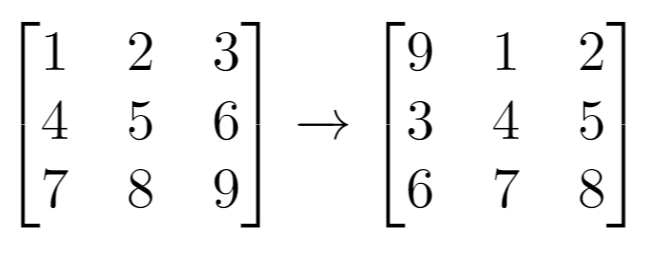
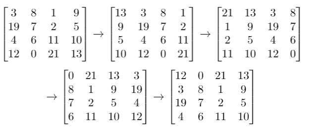

# 1260. Shift 2D Grid


## Level - easy


## Task
Given a 2D grid of size m x n and an integer k. You need to shift the grid k times.

In one shift operation:
- Element at grid[i][j] moves to grid[i][j + 1].
- Element at grid[i][n - 1] moves to grid[i + 1][0].
- Element at grid[m - 1][n - 1] moves to grid[0][0].

Return the 2D grid after applying shift operation k times.


## Объяснение
Дан двумерный массив (список списков) размера m×nm×n, а также число kk. Нужно выполнить kk циклических сдвигов вправо таким образом, чтобы:
- Элементы в строке сдвигались вправо.
- Последний элемент строки переходил в начало следующей строки.
- Последний элемент матрицы переходил в её первый элемент.

Вход:
```
grid = [[1,2,3],
        [4,5,6],
        [7,8,9]]
k = 1
```

Выход:
```
[[9,1,2],
 [3,4,5],
 [6,7,8]]
```

Алгоритм:
1. Получаем размеры mm и nn.
2. Разворачиваем матрицу в одномерный список.
3. Делаем циклический сдвиг (используя срез или deque).
4. Заполняем новую матрицу по строкам.


## Example 1:

```
Input: grid = [[1,2,3],[4,5,6],[7,8,9]], k = 1
Output: [[9,1,2],[3,4,5],[6,7,8]]
```


## Example 2:

```
Input: grid = [[3,8,1,9],[19,7,2,5],[4,6,11,10],[12,0,21,13]], k = 4
Output: [[12,0,21,13],[3,8,1,9],[19,7,2,5],[4,6,11,10]]
```


## Example 3:
```
Input: grid = [[1,2,3],[4,5,6],[7,8,9]], k = 9
Output: [[1,2,3],[4,5,6],[7,8,9]]
```


## Constraints:
- m == grid.length
- n == grid[i].length
- 1 <= m <= 50
- 1 <= n <= 50
- -1000 <= grid[i][j] <= 1000
- 0 <= k <= 100