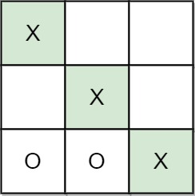
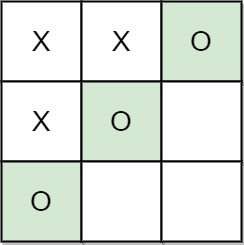
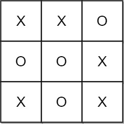

# 1275. Find Winner on a Tic Tac Toe Game


## Level - easy


## Task
Tic-tac-toe is played by two players A and B on a 3 x 3 grid. The rules of Tic-Tac-Toe are:
- Players take turns placing characters into empty squares ' '.
- The first player A always places 'X' characters, while the second player B always places 'O' characters.
- 'X' and 'O' characters are always placed into empty squares, never on filled ones.
- The game ends when there are three of the same (non-empty) character filling any row, column, or diagonal.
- The game also ends if all squares are non-empty.
- No more moves can be played if the game is over.


Given a 2D integer array moves where moves[i] = [rowi, coli] indicates that the ith move will be played on grid[rowi][coli]. 
return the winner of the game if it exists (A or B). In case the game ends in a draw return "Draw". If there are still movements to play return "Pending".

You can assume that moves is valid (i.e., it follows the rules of Tic-Tac-Toe), the grid is initially empty, and A will play first.


## Объяснение
Задача заключается в определении победителя в игре "Крестики-нолики" (Tic Tac Toe) на основе последовательности ходов двух игроков. 
Игра ведётся на поле 3x3, и задача требует определить, кто выиграл (игрок "X" или "O"), или же игра завершилась ничьей, либо ещё продолжается.
- Даны два списка ходов: moves, где каждый ход представлен парой чисел [row, col], обозначающих строку и столбец на поле 3x3.
- Первый игрок ("X") делает ходы на нечётных позициях в списке moves, а второй игрок ("O") — на чётных.
- Необходимо определить, кто выиграл, или вернуть, что игра завершилась ничьей или ещё продолжается.

Пример:  
moves = [[0,0],[2,0],[1,1],[2,1],[2,2]]
- Игрок "X" делает ходы: [0,0], [1,1], [2,2].
- Игрок "O" делает ходы: [2,0], [2,1].
- В этом случае игрок "X" выигрывает, так как у него три крестика по диагонали.

Решение:
1. Создайте поле 3x3 и заполните его символами "X" и "O" на основе списка ходов.
2. Проверьте все возможные выигрышные комбинации:
2.1. Три одинаковых символа в строке.
2.2. Три одинаковых символа в столбце.
2.3. Три одинаковых символа по диагонали.
3. Если выигрышная комбинация найдена, верните соответствующего победителя.
4. Если все клетки заполнены, но победителя нет, верните "Draw".
5. ыЕсли остались пустые клетки и победителя нет, верните "Pending".


## Example 1:

```
Input: moves = [[0,0],[2,0],[1,1],[2,1],[2,2]]
Output: "A"
Explanation: A wins, they always play first.
```


## Example 2:

```
Input: moves = [[0,0],[1,1],[0,1],[0,2],[1,0],[2,0]]
Output: "B"
Explanation: B wins.
```


## Example 3:

```
Input: moves = [[0,0],[1,1],[2,0],[1,0],[1,2],[2,1],[0,1],[0,2],[2,2]]
Output: "Draw"
Explanation: The game ends in a draw since there are no moves to make.
```


## Constraints:
- 1 <= moves.length <= 9
- moves[i].length == 2
- 0 <= rowi, coli <= 2
- There are no repeated elements on moves.
- moves follow the rules of tic tac toe.