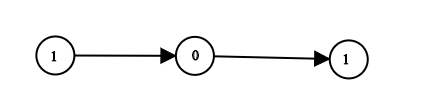

# 1290. Convert Binary Number in a Linked List to Integer


## Level - easy


## Task
Given head which is a reference node to a singly-linked list. 
The value of each node in the linked list is either 0 or 1. The linked list holds the binary representation of a number.

Return the decimal value of the number in the linked list.

The most significant bit is at the head of the linked list.


## Объяснение
Задача заключается в том, чтобы преобразовать бинарное число, представленное в виде связного списка, в десятичное число. 
Каждый узел связного списка содержит значение 0 или 1, и список представляет собой бинарное число, 
где голова списка соответствует старшему биту (MSB — Most Significant Bit).

- Дано: Ссылка на голову связного списка, где каждый узел содержит либо 0, либо 1.
- Задача: Вернуть десятичное значение числа, представленного этим связным списком.

Пример:
- Вход: head = [1, 0, 1]
- Выход: 5
- Объяснение: Бинарное число 101 в десятичной системе равно 5 (1 * 2^2 + 0 * 2^1 + 1 * 2^0 = 4 + 0 + 1 = 5).

Для решения задачи нужно пройтись по связному списку и на каждом шаге обновлять текущее десятичное значение, 
основываясь на значении текущего узла. Это можно сделать с помощью побитовых операций или арифметических операций.


## Example 1:

```
Input: head = [1,0,1]
Output: 5
Explanation: (101) in base 2 = (5) in base 10
```


## Example 2:
```
Input: head = [0]
Output: 0
```


## Constraints:
- The Linked List is not empty.
- Number of nodes will not exceed 30.
- Each node's value is either 0 or 1.