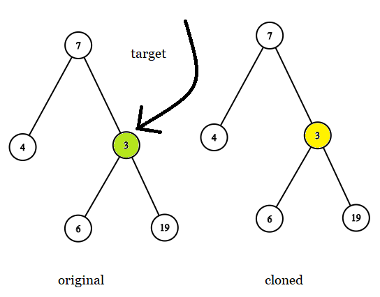
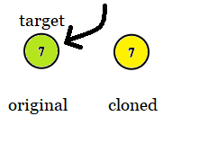
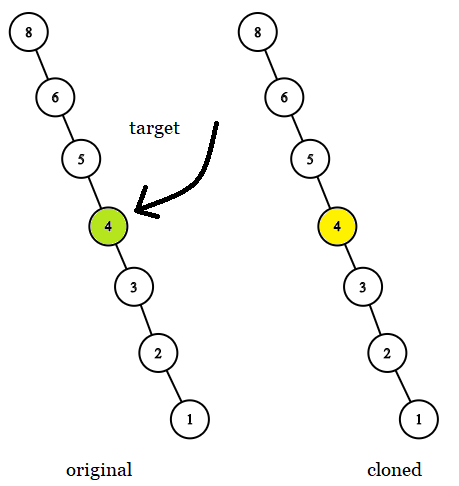

# 1379. Find a Corresponding Node of a Binary Tree in a Clone of That Tree


## Level - easy


## Task
Given two binary trees original and cloned and given a reference to a node target in the original tree.

The cloned tree is a copy of the original tree.

Return a reference to the same node in the cloned tree.

Note that you are not allowed to change any of the two trees or the target node and the answer must be a reference to a node in the cloned tree.


## Объяснение:
Даны два идентичных бинарных дерева: оригинальное дерево original и его клон cloned. 
Также дана ссылка на узел target в оригинальном дереве. Необходимо найти соответствующий узел в клонированном дереве.
Нужно найти узел в клоне дерева, который соответствует узлу в исходном дереве.

Важные моменты:
- Деревья идентичны по структуре и значениям узлов.
- Нельзя просто сравнивать значения узлов, так как в дереве могут быть дубликаты.
- Нужно найти узел в cloned, который соответствует узлу target в original.

Решение:
Используется обход дерева (например, DFS или BFS) для поиска узла в cloned, который находится в той же позиции, что и target в original.


## Example 1:

```
Input: tree = [7,4,3,null,null,6,19], target = 3
Output: 3
Explanation: In all examples the original and cloned trees are shown. The target node is a green node from the original tree. The answer is the yellow node from the cloned tree.
```


## Example 2:

```
Input: tree = [7], target =  7
Output: 7
```

## Example 3:

```
Input: tree = [8,null,6,null,5,null,4,null,3,null,2,null,1], target = 4
Output: 4
```


## Constraints:
- The number of nodes in the tree is in the range [1, 10^4].
- The values of the nodes of the tree are unique.
- target node is a node from the original tree and is not null.
 

## Follow up: 
Could you solve the problem if repeated values on the tree are allowed?