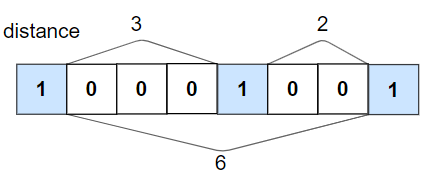

# 1437. Check If All 1's Are at Least Length K Places Away


## Level - easy


## Task
Given an binary array nums and an integer k, return true if all 1's are at least k places away from each other, otherwise return false.


## Объяснение
Для массива nums и целого числа k нужно убедиться, 
что для каждой пары соседних единиц в массиве расстояние между ними (количество элементов между ними) равно или превышает k.

Например:
- nums = [1,0,0,0,1,0,0,1], k = 2

Ответ: true
- Расстояние между первой и второй единицей: 3 нуля (индексы 1,2,3) >= 2
- Расстояние между второй и третьей единицей: 2 нуля (индексы 5,6) >= 2


## Example 1:

```
Input: nums = [1,0,0,0,1,0,0,1], k = 2
Output: true
Explanation: Each of the 1s are at least 2 places away from each other.
```


## Example 2:

```
Input: nums = [1,0,0,1,0,1], k = 2
Output: false
Explanation: The second 1 and third 1 are only one apart from each other.
```


## Constraints:
- 1 <= nums.length <= 10^5
- 0 <= k <= nums.length
- nums[i] is 0 or 1