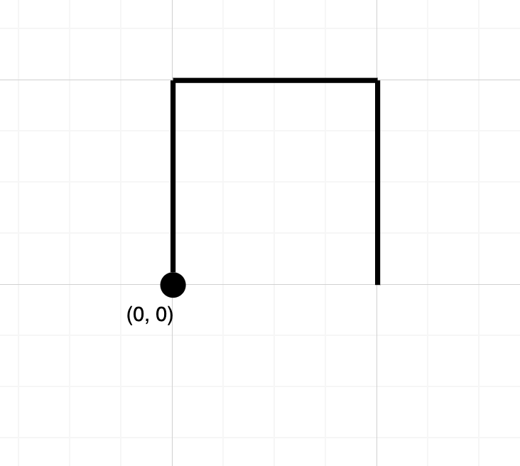
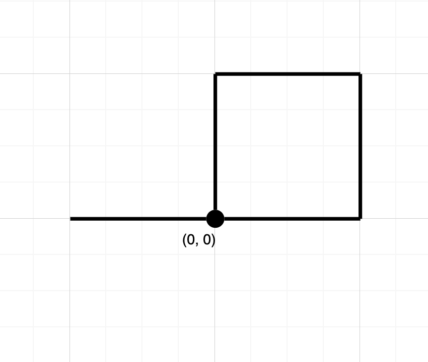

# 1496. Path Crossing


## Level - easy


## Task
Given a string path, where path[i] = 'N', 'S', 'E' or 'W', each representing moving one unit north, south, east, or west, respectively. 
You start at the origin (0, 0) on a 2D plane and walk on the path specified by path.

Return true if the path crosses itself at any point, that is, if at any time you are on a location you have previously visited. Return false otherwise.


## Объяснение
Нам дается строка, состоящая из букв N, S, E, W, которые означают направления движения:
- N - North (Север)
- S - South (Юг)
- E - East (Восток)
- W - West (Запад)

Начальная позиция - точка с координатами (0,0).

За каждый шаг мы перемещаемся на 1 единицу в указанном направлении:
- N: y += 1
- S: y -= 1
- E: x += 1
- W: x -= 1

Основная задача - определить, пересекает ли путь сам себя. То есть:
- Если мы в процессе движения попадаем в точку, где уже были - возвращаем true
- Если все точки пути уникальны - возвращаем false

Это классическая задача на отслеживание координат и поиск повторяющихся позиций, 
которая может быть эффективно решена с использованием хеш-множества для хранения посещенных точек.


## Example 1:

```
Input: path = "NES"
Output: false 
Explanation: Notice that the path doesn't cross any point more than once.
```


## Example 2:

```
Input: path = "NESWW"
Output: true
Explanation: Notice that the path visits the origin twice.
```


## Constraints:
- 1 <= path.length <= 10^4
- path[i] is either 'N', 'S', 'E', or 'W'.