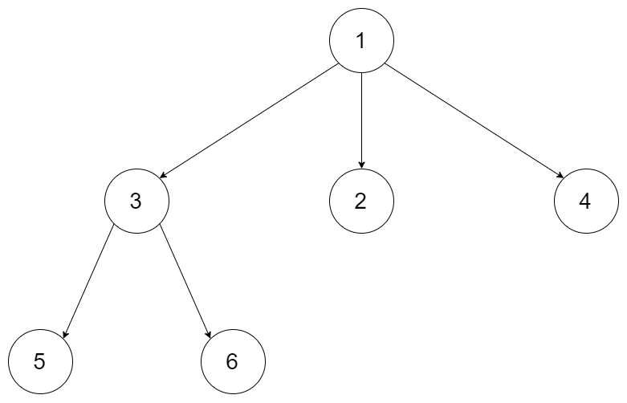

# 590. N-ary Tree Postorder Traversal


## Level - easy


## Task
Given the root of an n-ary tree, return the postorder traversal of its nodes' values.

Nary-Tree input serialization is represented in their level order traversal. 
Each group of children is separated by the null value (See examples).


## Объяснение
Задача относится к задачам по обходу дерева. В частности, это задача о постфиксном обходе n-арного дерева.

"N-ary Tree" в данном контексте означает, что каждый узел дерева может иметь несколько дочерних узлов. 
"Postorder Traversal" - это обход дерева, который сначала посещает все дочерние узлы узла, а затем сам узел.

Таким образом, задача состоит в том, чтобы вернуть список значений узлов дерева в порядке, 
соответствующем постфиксному обходу.

Например, если у нас есть дерево:
````
    1
   /|\
  3 2 4
 / \
5   6
````

Постфиксный обход этого дерева будет выглядеть так: [5, 6, 3, 2, 4, 1].


## Example 1: 

````
Input: root = [1,null,3,2,4,null,5,6]
Output: [5,6,3,2,4,1]
````


## Example 2:

````
Input: root = [1,null,2,3,4,5,null,null,6,7,null,8,null,9,10,null,null,11,null,12,null,13,null,null,14]
Output: [2,6,14,11,7,3,12,8,4,13,9,10,5,1]
````


## Constraints:
- The number of nodes in the tree is in the range [0, 10^4].
- 0 <= Node.val <= 10^4
- The height of the n-ary tree is less than or equal to 1000.

Follow up: Recursive solution is trivial, could you do it iteratively?