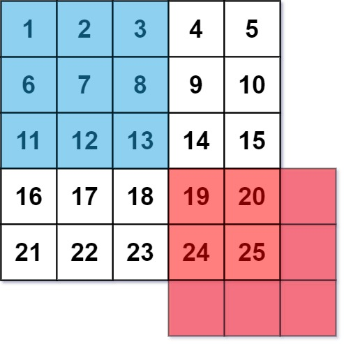
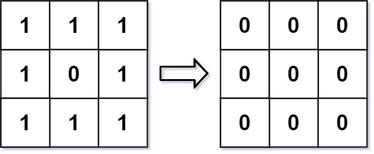
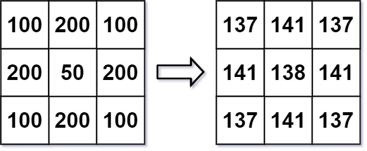

# 661. Image Smoother


## Level - easy


## Task
An image smoother is a filter of the size 3 x 3 that can be applied to each cell of an image by rounding down the average of the cell and the eight surrounding cells (i.e., the average of the nine cells in the blue smoother). 
If one or more of the surrounding cells of a cell is not present, we do not consider it in the average (i.e., the average of the four cells in the red smoother).




Given an m x n integer matrix img representing the grayscale of an image, return the image after applying the smoother on each cell of it.


## Объяснение
Дана двумерная матрица M, представляющая изображение. 
Каждый элемент матрицы M[i][j] представляет интенсивность пикселя в позиции (i, j). 
Необходимо создать новую матрицу, в которой каждый элемент будет средним значением интенсивности пикселей в окрестности 3x3 вокруг каждого пикселя исходной матрицы. 
Если пиксель находится на границе матрицы, то в расчет берутся только доступные пиксели.

Пример:
Ввод: M = [[1,1,1],[1,0,1],[1,1,1]]


## Example 1:

````
Input: img = [[1,1,1],[1,0,1],[1,1,1]]
Output: [[0,0,0],[0,0,0],[0,0,0]]
Explanation:
For the points (0,0), (0,2), (2,0), (2,2): floor(3/4) = floor(0.75) = 0
For the points (0,1), (1,0), (1,2), (2,1): floor(5/6) = floor(0.83333333) = 0
For the point (1,1): floor(8/9) = floor(0.88888889) = 0
````


## Example 2:

````
Input: img = [[100,200,100],[200,50,200],[100,200,100]]
Output: [[137,141,137],[141,138,141],[137,141,137]]
Explanation:
For the points (0,0), (0,2), (2,0), (2,2): floor((100+200+200+50)/4) = floor(137.5) = 137
For the points (0,1), (1,0), (1,2), (2,1): floor((200+200+50+200+100+100)/6) = floor(141.666667) = 141
For the point (1,1): floor((50+200+200+200+200+100+100+100+100)/9) = floor(138.888889) = 138
````


## Constraints:
- m == img.length
- n == img[i].length
- 1 <= m, n <= 200
- 0 <= img[i][j] <= 255