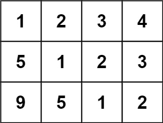
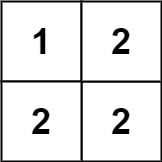

# 766. Toeplitz Matrix


## Level - easy


## Task
Given an m x n matrix, return true if the matrix is Toeplitz. Otherwise, return false.

A matrix is Toeplitz if every diagonal from top-left to bottom-right has the same elements.


## Объяснение
Матрица Топлица — это такая матрица, в которой каждая диагональ, идущая сверху-слева вниз-справа, содержит одинаковые элементы.

Пример матрицы Топлица:
````
1 2 3 4
5 1 2 3
9 5 1 2
````

Вам дана матрица matrix размером m x n. Необходимо определить, является ли она матрицей Топлица. Если да, то вернуть true, иначе false.

Пример-1:
````
Вход: matrix = [[1,2,3,4],[5,1,2,3],[9,5,1,2]]
Выход: true
````

Пример-2:
````
Вход: matrix = [[1,2],[2,2]]
Выход: false
````


## Example 1:

````
Input: matrix = [[1,2,3,4],[5,1,2,3],[9,5,1,2]]
Output: true
Explanation:
In the above grid, the diagonals are:
"[9]", "[5, 5]", "[1, 1, 1]", "[2, 2, 2]", "[3, 3]", "[4]".
In each diagonal all elements are the same, so the answer is True.
````


## Example 2:

````
Input: matrix = [[1,2],[2,2]]
Output: false
Explanation:
The diagonal "[1, 2]" has different elements.
````


## Constraints:
- m == matrix.length
- n == matrix[i].length
- 1 <= m, n <= 20
- 0 <= matrix[i][j] <= 99


## Follow up:
- What if the matrix is stored on disk, and the memory is limited such that you can only load at most one row of the matrix into the memory at once?
- What if the matrix is so large that you can only load up a partial row into the memory at once?