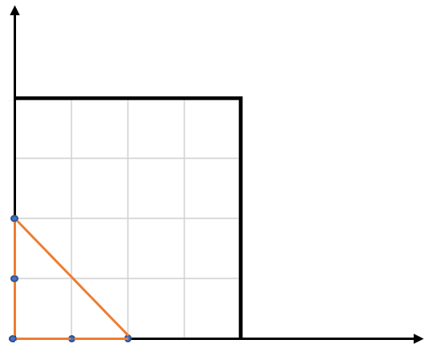

# 812. Largest Triangle Area


## Level - easy


## Task
Given an array of points on the X-Y plane points where points[i] = [xi, yi], 
return the area of the largest triangle that can be formed by any three different points. 
Answers within 10-5 of the actual answer will be accepted.


## Объяснение
Задача требует от нас найти максимальную площадь треугольника, который можно построить из заданного набора точек на плоскости.
У нас есть массив точек points, где каждая точка представлена в виде [x, y]. Нам нужно найти максимальную площадь треугольника, 
который можно построить, используя любые три точки из этого массива.

Площадь треугольника, образованного тремя точками (x1, y1), (x2, y2) и (x3, y3), может быть вычислена по формуле:
````
S = |0.5 * (x1 * (y2 - y3) + x2 * (y3 - y1) + x3 * (y1 - y2))|
````    

## Example 1:

````
Input: points = [[0,0],[0,1],[1,0],[0,2],[2,0]]
Output: 2.00000
Explanation: The five points are shown in the above figure. The red triangle is the largest.
````


## Example 2:
````
Input: points = [[1,0],[0,0],[0,1]]
Output: 0.50000
````


## Constraints:
- 3 <= points.length <= 50
- -50 <= xi, yi <= 50
- All the given points are unique.