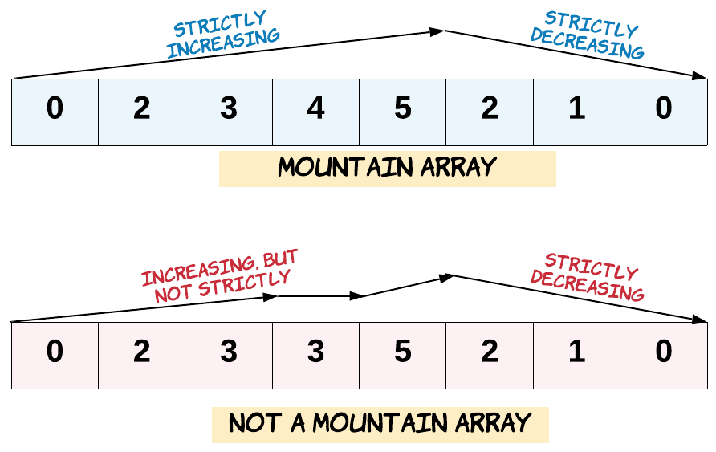

# 941. Valid Mountain Array


## Level - easy


## Task
Given an array of integers arr, return true if and only if it is a valid mountain array.

Recall that arr is a mountain array if and only if:

- arr.length >= 3
- There exists some i with 0 < i < arr.length - 1 such that:
- - arr[0] < arr[1] < ... < arr[i - 1] < arr[i]
- - arr[i] > arr[i + 1] > ... > arr[arr.length - 1]




## Объяснение
Задача требует от нас определить, является ли заданный массив целых чисел "горным" массивом. 
"Горный" массив — это массив, который сначала возрастает, а затем убывает. 

Примеры:
- Валидный горный массив: [0, 3, 2, 1]
- Невалидный горный массив: [2, 1] (слишком короткий)
- Невалидный горный массив: [3, 5, 5] (нет убывающей части)
- Невалидный горный массив: [0, 1, 2, 3, 4, 5, 6, 7, 8, 9] (нет убывающей части)


## Example 1:
```
Input: arr = [2,1]
Output: false
```


## Example 2:
```
Input: arr = [3,5,5]
Output: false
```


## Example 3:
```
Input: arr = [0,3,2,1]
Output: true
```


## Constraints:
- 1 <= arr.length <= 10^4
- 0 <= arr[i] <= 10