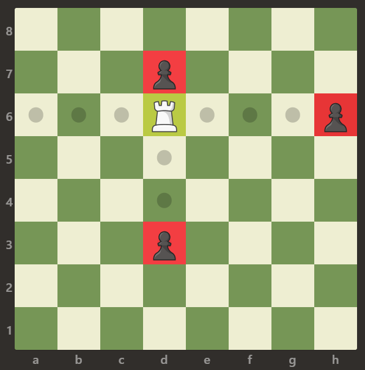
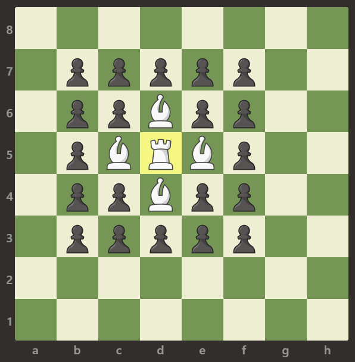
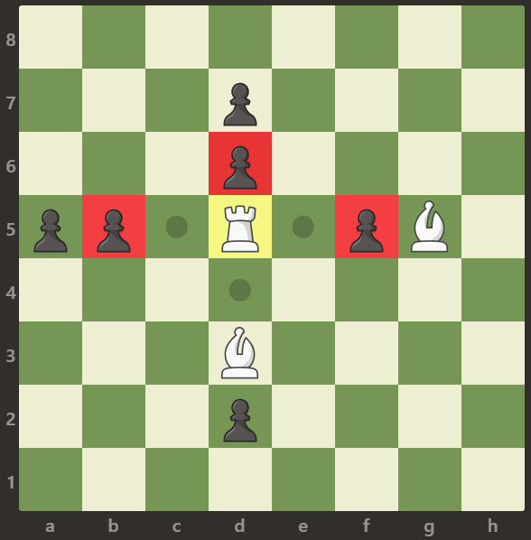

# 999. Available Captures for Rook


## Level - easy


## Task
You are given an 8 x 8 matrix representing a chessboard. There is exactly one white rook represented by 'R', some number of white bishops 'B', and some number of black pawns 'p'. Empty squares are represented by '.'.

A rook can move any number of squares horizontally or vertically (up, down, left, right) until it reaches another piece or the edge of the board. A rook is attacking a pawn if it can move to the pawn's square in one move.

Note: A rook cannot move through other pieces, such as bishops or pawns. This means a rook cannot attack a pawn if there is another piece blocking the path.

Return the number of pawns the white rook is attacking.


## Объяснение
Вам дана матрица 8 на 8, представляющая шахматное поле. На этом поле ровно одна белая ладья (обозначается 'R'), 
некоторое количество белых слонов ('B') и некоторое количество черных пешек ('p'). Пустые клетки на поле обозначены точками ('.').

Ладья может двигаться любое количество клеток горизонтально или вертикально (вверх, вниз, влево, вправо) до тех пор, пока она не встретит другую фигуру или край поля. 
Ладья считается атакующей пешку, если она может переместиться на клетку с этой пешкой за один ход.

Задача состоит в том, чтобы определить количество пешек, которые ладья может захватить одним ходом.


## Example 1:

```
Input: board = [[".",".",".",".",".",".",".","."],[".",".",".","p",".",".",".","."],[".",".",".","R",".",".",".","p"],[".",".",".",".",".",".",".","."],[".",".",".",".",".",".",".","."],[".",".",".","p",".",".",".","."],[".",".",".",".",".",".",".","."],[".",".",".",".",".",".",".","."]]

Output: 3

Explanation:
In this example, the rook is attacking all the pawns.
```


## Example 2:

```
Input: board = [[".",".",".",".",".",".","."],[".","p","p","p","p","p",".","."],[".","p","p","B","p","p",".","."],[".","p","B","R","B","p",".","."],[".","p","p","B","p","p",".","."],[".","p","p","p","p","p",".","."],[".",".",".",".",".",".",".","."],[".",".",".",".",".",".",".","."]]

Output: 0

Explanation:

The bishops are blocking the rook from attacking any of the pawns.
```


## Example 3:

```
Input: board = [[".",".",".",".",".",".",".","."],[".",".",".","p",".",".",".","."],[".",".",".","p",".",".",".","."],["p","p",".","R",".","p","B","."],[".",".",".",".",".",".",".","."],[".",".",".","B",".",".",".","."],[".",".",".","p",".",".",".","."],[".",".",".",".",".",".",".","."]]

Output: 3

Explanation:

The rook is attacking the pawns at positions b5, d6, and f5.
```

## Constraints:
- board.length == 8
- board[i].length == 8
- board[i][j] is either 'R', '.', 'B', or 'p'
- There is exactly one cell with board[i][j] == 'R'