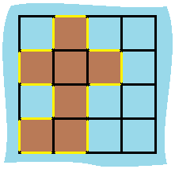

# 463. Island Perimeter


## Level - easy


## Task
You are given row x col grid representing a map where grid[i][j] = 1 represents land and grid[i][j] = 0 represents water.

Grid cells are connected horizontally/vertically (not diagonally). 
The grid is completely surrounded by water, and there is exactly one island (i.e., one or more connected land cells).

The island doesn't have "lakes", meaning the water inside isn't connected to the water around the island. 
One cell is a square with side length 1. The grid is rectangular, width and height don't exceed 100. 
Determine the perimeter of the island.


## Объяснение
Это задача на нахождение периметра острова на двумерной сетке.

Остров представлен двоичной матрицей, где 0 - это вода, а 1 - это земля. 
Остров полностью окружен водой, и он состоит из сетки 1x1 квадратов. Остров может быть соединенным или не соединенным. 
Один остров не соединяется с другим.

Задача состоит в том, чтобы найти периметр острова. Периметр острова - это сумма длин всех его границ.

Например, если у вас есть остров, представленный следующей матрицей:
````
0 1 0 0
1 1 1 0
0 1 0 0
1 1 0 0
````
Периметр этого острова будет равен 16, потому что у него есть 12 граничных клеток и 4 внутренних клетки.

Решение этой задачи может быть реализовано с использованием различных алгоритмов, 
таких как поиск в глубину (DFS) или поиск в ширину (BFS), а также анализ соседних клеток.


## Example 1:

````
Input: grid = [[0,1,0,0],[1,1,1,0],[0,1,0,0],[1,1,0,0]]
Output: 16
Explanation: The perimeter is the 16 yellow stripes in the image above.
````


## Example 2:
````
Input: grid = [[1]]
Output: 4
````

## Example 3:
````
Input: grid = [[1,0]]
Output: 4
````


## Constraints:
- row == grid.length
- col == grid[i].length
- 1 <= row, col <= 100
- grid[i][j] is 0 or 1.
- There is exactly one island in grid.