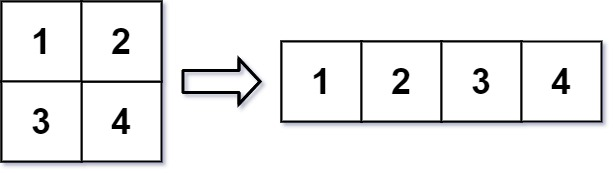
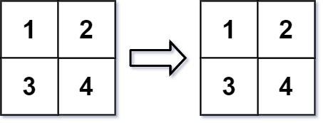

# 566. Reshape the Matrix


## Level - easy


## Task
In MATLAB, there is a handy function called reshape which can reshape an m x n matrix into a new one with a different size r x c keeping its original data.

You are given an m x n matrix mat and two integers r and c representing the number of rows and the number of columns of the wanted reshaped matrix.

The reshaped matrix should be filled with all the elements of the original matrix in the same row-traversing order as they were.

If the reshape operation with given parameters is possible and legal, 
output the new reshaped matrix; Otherwise, output the original matrix.


## Объяснение
Задача предлагает вам переформатировать двумерный массив (матрицу) в новую размерность, не изменяя его данные.
Вам дается двумерный массив размера m x n и два целых числа r и c, представляющие желаемую размерность нового массива.

Ваша задача - создать новый двумерный массив размера r x c, содержащий те же элементы, что и исходный массив, но в новой форме. 
Если это невозможно, вы должны вернуть исходный массив.

Важно отметить, что количество элементов в исходном и новом массиве должно быть одинаковым.

Например, если вы получаете массив nums = [[1,2], [3,4]] и r = 1, c = 4, ваша функция должна вернуть [[1,2,3,4]].

## Example 1:

````
Input: mat = [[1,2],[3,4]], r = 1, c = 4
Output: [[1,2,3,4]]
````


## Example 2:

````
Input: mat = [[1,2],[3,4]], r = 2, c = 4
Output: [[1,2],[3,4]]
````


## Constraints:
- m == mat.length
- n == mat[i].length
- 1 <= m, n <= 100
- -1000 <= mat[i][j] <= 1000
- 1 <= r, c <= 300
