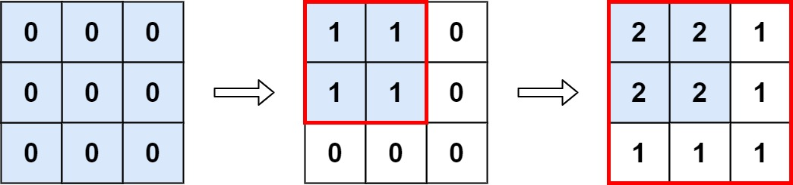

# 598. Range Addition II


## Level - easy


## Task
You are given an m x n matrix M initialized with all 0's and an array of operations ops, 
where ops[i] = [ai, bi] means M[x][y] should be incremented by one for all 0 <= x < ai and 0 <= y < bi.

Count and return the number of maximum integers in the matrix after performing all the operations.


## Объяснение
Дан массив нулей размера m x n. 
Вам нужно выполнить несколько операций добавления, где каждая операция представляет собой инкремент всех элементов в определенном диапазоне. 
После выполнения всех операций вы должны вернуть количество максимальных элементов в массиве.

Например, если вы имеете массив размера 3x3 и операции добавления:
- Добавьте 1 к каждому элементу в диапазоне от (1,1) до (2,2).
- Добавьте 1 к каждому элементу в диапазоне от (0,0) до (2,2).

После первой операции массив будет таким:
````
1 1 0
1 1 0
0 0 0
````

После второй операции массив будет выглядеть так:
````
2 2 1
2 2 1
1 1 1
````

Таким образом, максимальный элемент в массиве - это 2, поэтому ответ будет 1.

Задача требует написать функцию, которая будет принимать размер массива и список операций добавления, 
а затем вернет количество максимальных элементов в массиве после выполнения всех операций.


## Example 1:

````
Input: m = 3, n = 3, ops = [[2,2],[3,3]]
Output: 4
Explanation: The maximum integer in M is 2, and there are four of it in M. So return 4.
````


## Example 2:
````
Input: m = 3, n = 3, ops = [[2,2],[3,3],[3,3],[3,3],[2,2],[3,3],[3,3],[3,3],[2,2],[3,3],[3,3],[3,3]]
Output: 4
````


## Example 3:
````
Input: m = 3, n = 3, ops = []
Output: 9
````


## Constraints:
- 1 <= m, n <= 4 * 10^4
- 0 <= ops.length <= 10^4
- ops[i].length == 2
- 1 <= a_i <= m
- 1 <= b_i <= n