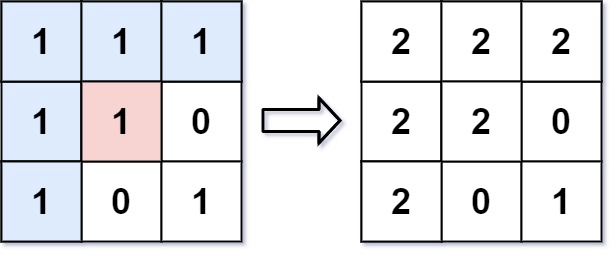

# 733. Flood Fill

 
## Level = easy.


## Task
An image is represented by an m x n integer grid image where image[i][j] represents the pixel value of the image.

You are also given three integers sr, sc, and color. 
You should perform a flood fill on the image starting from the pixel image[sr][sc].

To perform a flood fill, consider the starting pixel, 
plus any pixels connected 4-directionally to the starting pixel of the same color as the starting pixel, 
plus any pixels connected 4-directionally to those pixels (also with the same color), and so on. 
Replace the color of all of the aforementioned pixels with color.

Return the modified image after performing the flood fill.

## Объяснение
Чтобы решить эту задачу, вам нужно использовать алгоритм поиска в глубину (DFS) или алгоритм поиска в ширину (BFS). 
В этой задаче вам нужно заменить цвет всех пикселей, которые соединены с начальным пикселем одинаковым цветом.

sr и sc - это координаты начальной точки для алгоритма покраски (flood fill).
- sr (start row) - это номер строки, в которой находится начальная точка.
- sc (start column) - это номер столбца, в котором находится начальная точка.

То есть, sr и sc определяют, откуда начинается процесс покраски. 
Алгоритм начинает покраску из пикселя, который находится в строке sr и столбце sc.

Есть несколько алгоритмов, которые можно использовать для решения задачи покраски (flood fill). 
Вот некоторые из них:
1. Depth-First Search (DFS): Этот алгоритм использует стек для хранения вершин, которые нужно посетить. 
Алгоритм начинает с начальной вершины и посещает все ее соседей, после чего переходит к следующей вершине из стека.
2. Breadth-First Search (BFS): Этот алгоритм использует очередь для хранения вершин, которые нужно посетить. 
Алгоритм начинает с начальной вершины и посещает все ее соседей, после чего переходит к следующей вершине из очереди.
3. Recursive DFS: Этот алгоритм использует рекурсию для посещения всех соседей начальной вершины.
4. Iterative DFS: Этот алгоритм использует стек для хранения вершин, которые нужно посетить. 
Алгоритм начинает с начальной вершины и посещает все ее соседей, после чего переходит к следующей вершине из стека.
5. Iterative BFS: Этот алгоритм использует очередь для хранения вершин, которые нужно посетить. 
Алгоритм начинает с начальной вершины и посещает все ее соседей, после чего переходит к следующей вершине из очереди.

Union-Find: Этот алгоритм использует структуру данных Union-Find для хранения множеств вершин. 
Алгоритм начинает с начальной вершины и объединяет ее с соседями, которые имеют тот же цвет.

Каждый из этих алгоритмов имеет свои преимущества и недостатки, и выбор зависит от конкретной задачи.


## Example 1:

````
Input: image = [[1,1,1],[1,1,0],[1,0,1]], sr = 1, sc = 1, color = 2
Output: [[2,2,2],[2,2,0],[2,0,1]]
Explanation: From the center of the image with position (sr, sc) = (1, 1) (i.e., the red pixel), 
all pixels connected by a path of the same color as the starting pixel (i.e., the blue pixels) 
are colored with the new color.
Note the bottom corner is not colored 2, because it is not 4-directionally connected to the starting pixel.
````

## Example 2:
````
Input: image = [[0,0,0],[0,0,0]], sr = 0, sc = 0, color = 0
Output: [[0,0,0],[0,0,0]]
Explanation: The starting pixel is already colored 0, so no changes are made to the image.
````

## Constraints:
- m == image.length
- n == image[i].length
- 1 <= m, n <= 50
- 0 <= image[i][j], color < 216
- 0 <= sr < m
- 0 <= sc < n