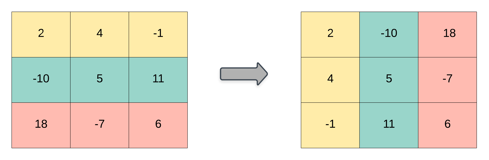

# 867. Transpose Matrix


## Level - easy


## Task
Given a 2D integer array matrix, return the transpose of matrix.

The transpose of a matrix is the matrix flipped over its main diagonal, switching the matrix's row and column indices.




## Объяснение
Задача предполагает транспонирование матрицы. 
Транспонирование матрицы - это процесс, при котором строки исходной матрицы становятся столбцами, а столбцы - строками.

Например, если у нас есть матрица:
````
1 2 3
4 5 6
7 8 9
````

После транспонирования она будет выглядеть так:
````
1 4 7
2 5 8
3 6 9
````

Таким образом, каждая строка стала столбцом, а каждый столбец - строкой.

Задача состоит в том, чтобы написать функцию, 
которая будет принимать матрицу в качестве входных данных и возвращать транспонированную матрицу.


## Example 1:
````
Input: matrix = [[1,2,3],[4,5,6],[7,8,9]]
Output: [[1,4,7],[2,5,8],[3,6,9]]
````


## Example 2:
````
Input: matrix = [[1,2,3],[4,5,6]]
Output: [[1,4],[2,5],[3,6]]
````


## Constraints:
- m == matrix.length
- n == matrix[i].length
- 1 <= m, n <= 1000
- 1 <= m * n <= 10^5
- -10^9 <= matrix[i][j] <= 10^9