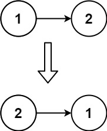

# 206. Reverse Linked List


## Level - easy


## Task
Given the head of a singly linked list, reverse the list, and return the reversed list.


## Example 1:

````
Input: head = [1,2,3,4,5]
Output: [5,4,3,2,1]
````

## Example 2:

````
Input: head = [1,2]
Output: [2,1]
````

## Example 3:
````
Input: head = []
Output: []
````

## Constraints:
- The number of nodes in the list is the range [0, 5000].
- -5000 <= Node.val <= 5000


## Задачу можно решить этими методами
1. Iterative Reversal: This method involves reversing the direction of the pointers in the linked list. It involves initializing three pointers: prev, current, and next. prev and next are initially set to nil, and current is set to the head of the linked list. Then, in each iteration, the direction of the Next pointer for the current node is reversed, and prev and current are moved one step forward. After the loop ends, prev will be pointing to the new head of the reversed list.

2. Recursive Reversal: This method involves reversing the linked list recursively. The base case for the recursion is when the head of the list is nil or the list has only one node. In the recursive case, the function calls itself with the next node as the argument, and then sets the Next pointer of the current node to the returned node from the recursive call. The Next pointer of the returned node is set to the current node, effectively reversing the direction of the pointers.

3. Stack-based Reversal: This method involves pushing the nodes of the linked list onto a stack, and then popping the nodes off the stack to create a new reversed list. This method has a time complexity of O(n), where n is the number of nodes in the linked list, and a space complexity of O(n), because it uses a stack to store the nodes.

4. In-place Reversal: This method involves reversing the linked list in-place, without using any extra space. It involves initializing three pointers: prev, current, and next. prev and next are initially set to nil, and current is set to the head of the linked list. Then, in each iteration, the direction of the Next pointer for the current node is reversed, and prev and current are moved one step forward. After the loop ends, prev will be pointing to the new head of the reversed list. This method has a time complexity of O(n), where n is the number of nodes in the linked list, and a space complexity of O(1), because it reverses the linked list in-place.