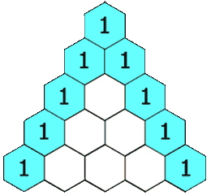

# 119. Pascal's Triangle II


## Level - easy


## Task
Given an integer rowIndex, return the rowIndexth (0-indexed) row of the Pascal's triangle.

In Pascal's triangle, each number is the sum of the two numbers directly above it as shown:



## Объяснение
Задача заключается в том, чтобы найти ряд в треугольнике Паскаля по заданному индексу строки. 
В треугольнике Паскаля на вершине и по бокам стоят единицы, а каждый следующий элемент является суммой двух элементов, 
расположенных на непосредственно выше него.

Например, для индекса строки 3 треугольник Паскаля будет выглядеть так:
   1
  1 1
 1 2 1
1 3 3 1

И требуемый ряд для индекса 3 будет [1, 3, 3, 1].

Задача требует оптимизировать алгоритм таким образом, чтобы использовать только O(rowIndex) дополнительной памяти, 
где rowIndex - индекс требуемой строки.


## Example 1:
````
Input: rowIndex = 3
Output: [1,3,3,1]
````


## Example 2:
````
Input: rowIndex = 0
Output: [1]
````


## Example 3:
````
Input: rowIndex = 1
Output: [1,1]
````


## Constraints:
- 0 <= rowIndex <= 33 

Follow up: Could you optimize your algorithm to use only O(rowIndex) extra space?