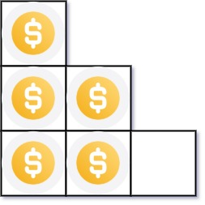
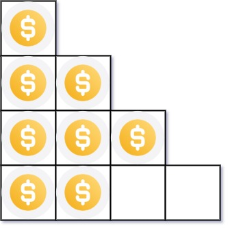

# 441. Arranging Coins


## Level - easy


## Task
You have n coins and you want to build a staircase with these coins. 
The staircase consists of k rows where the ith row has exactly i coins. 
The last row of the staircase may be incomplete.

Given the integer n, return the number of complete rows of the staircase you will build.


## Объяснение
Даны неограниченное количество рядов, в каждом из которых находится одинаковое количество монет. 
Первый ряд содержит одну монету, второй ряд - две монеты, третий ряд - три монеты и так далее.

Требуется написать функцию, которая принимает на вход целое число n, 
которое представляет количество монет, которые нужно разместить в рядах. 
Функция должна вернуть максимальное количество полных рядов, 
которые можно составить из этих монет.

Пример:
Input: n = 5
Output: 2
Explanation: Because the 3rd row is incomplete, we return 2.

В этом примере мы имеем 5 монет, и мы можем составить 2 полных ряда: первый ряд с 1 монетой и второй ряд с 2 монетами. 
Третий ряд будет неполным.


## Example 1:

````
Input: n = 5
Output: 2
Explanation: Because the 3rd row is incomplete, we return 2.
````


## Example 2:

````
Input: n = 8
Output: 3
Explanation: Because the 4th row is incomplete, we return 3.
````


## Constraints:
- 1 <= n <= 2^31 - 1