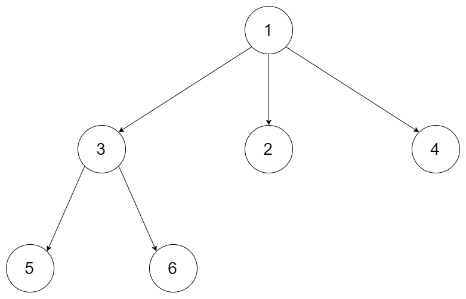
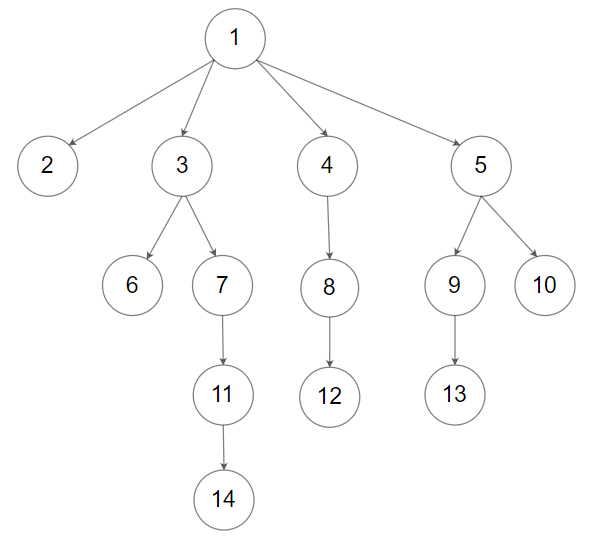

# 559. Maximum Depth of N-ary Tree


## Level - easy


## Task
Given a n-ary tree, find its maximum depth.

The maximum depth is the number of nodes along the longest path from the root node down to the farthest leaf node.

Nary-Tree input serialization is represented in their level order traversal, 
each group of children is separated by the null value (See examples).


## Объяснение
Задача заключается в нахождении максимальной глубины (количества уровней) в дереве с несколькими дочерними узлами. 
В дереве с несколькими дочерними узлами каждый узел может иметь несколько дочерних узлов. 
Глубина дерева определяется как количество узлов-альтернатив, которые нужно пройти от корня до самого дальнего листа.

Например:
````
      1
    / | \
   3  2  4
  / \
 5   6
````
Максимальная глубина будет равна 3, так как самое дальнее расстояние от корня до листа - это путь 1->3->5 или 1->3->6.

Задача требует написать функцию, которая будет принимать корень дерева и возвращать его максимальную глубину.


## Example 1:

````
Input: root = [1,null,3,2,4,null,5,6]
Output: 3
````


## Example 2:

````
Input: root = [1,null,2,3,4,5,null,null,6,7,null,8,null,9,10,null,null,11,null,12,null,13,null,null,14]
Output: 5
````


## Constraints:
- The total number of nodes is in the range [0, 10^4].
- The depth of the n-ary tree is less than or equal to 1000.