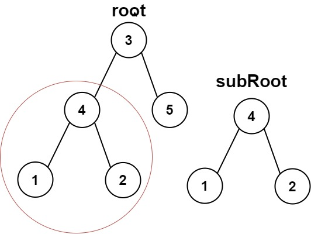
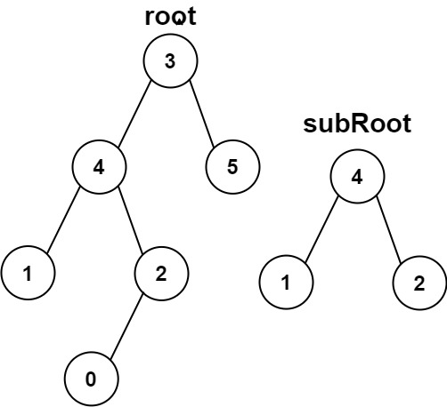

# 572. Subtree of Another Tree


## Level - easy


## Task
Given the roots of two binary trees root and subRoot, 
return true if there is a subtree of root with the same structure and node values of subRoot and false otherwise.

A subtree of a binary tree tree is a tree that consists of a node in tree and all of this node's descendants. 
The tree tree could also be considered as a subtree of itself.


## Объяснение
Задача состоит в том, чтобы определить, является ли дерево t поддеревом дерева s. 
Поддеревом считается дерево, которое состоит из одного или нескольких узлов дерева s, где узлы могут иметь дочерние узлы. 
Однако все узлы, которые являются дочерними узлами в дереве t, должны быть также дочерними узлами в дереве s.

Цель задачи - реализовать функцию, которая определяет, является ли дерево t поддеревом дерева s.

Дерево s может иметь больше узлов, чем дерево t. Все значения в деревьях s и t уникальны.

Например, если дерево s выглядит следующим образом:
````
     3
    / \
   4   5
  / \
 1   2
````

и дерево t выглядит так:
````
   4 
  / \
 1   2
````


## Example 1:

````
Input: root = [3,4,5,1,2], subRoot = [4,1,2]
Output: true
````


## Example 2:

````
Input: root = [3,4,5,1,2,null,null,null,null,0], subRoot = [4,1,2]
Output: false
````


## Constraints:
- The number of nodes in the root tree is in the range [1, 2000].
- The number of nodes in the subRoot tree is in the range [1, 1000].
- -10^4 <= root.val <= 10^4
- -10^4 <= subRoot.val <= 10^4
