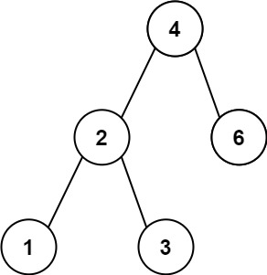

# 530. Minimum Absolute Difference in BST


## Level - easy


## Task
Given the root of a Binary Search Tree (BST), return the minimum absolute difference between the values of any two different nodes in the tree.


## Объяснение
Задача заключается в нахождении минимальной абсолютной разницы между значениями любых двух узлов в бинарном дереве поиска.

Для решения этой задачи, вы можете использовать алгоритм обхода дерева в глубину (DFS) или ширину (BFS). 
В обоих случаях, вы будете проходить по всем узлам дерева и сравнивать разницу между значениями каждого узла и его родителя.

Важно отметить, что в бинарном дереве поиска левое поддерево всегда меньше родителя, а правое поддерево больше родителя. 
Это свойство может помочь вам найти минимальную разницу.


## Как решать задачу
Задачу лучше решать с помощью алгоритма DFS In-order. Например, другой алгоритм BFS не подходит, так как он не гарантирует,
что мы посещаем все узлы в порядке возрастания значений. Кроме того будет иметь место дополнительные затраты памяти.


## Example 1:

````
Input: root = [4,2,6,1,3]
Output: 1
````


## Example 2:

````
Input: root = [1,0,48,null,null,12,49]
Output: 1
````


## Constraints:
- The number of nodes in the tree is in the range [2, 10^4].
- 0 <= Node.val <= 10^5