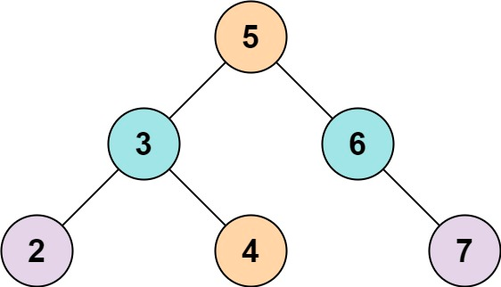
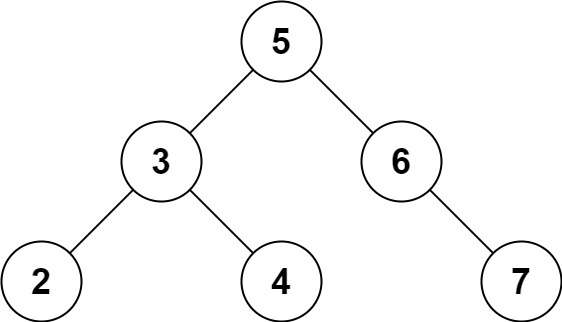

# 653. Two Sum IV - Input is a BST


## Level - easy


## Task
Given the root of a binary search tree and an integer k, return true if there exist two elements in the BST such that their sum is equal to k, or false otherwise.


## Объяснение
Задача заключается в поиске двух узлов в бинарном дереве поиска (BST), чтобы их сумма была равна заданному значению.

В BST все значения узлов слева от родительского узла меньше, а все значения узлов справа от родительского узла больше.

Задача состоит в том, чтобы найти два таких узла, чтобы их сумма была равна заданному значению.
Например, если заданное значение равно 9, и дерево выглядит так:
 5
/ \
3   6
/ \   \
2   4   7
Тогда сумма узлов 4 (5 + 4) и 7 (6 + 3) равна 9, поэтому функция должна вернуть true.


## Example 1:

````
Input: root = [5,3,6,2,4,null,7], k = 9
Output: true
````


## Example 2:

````
Input: root = [5,3,6,2,4,null,7], k = 28
Output: false
````


## Constraints:
- The number of nodes in the tree is in the range [1, 10^4].
- -10^4 <= Node.val <= 10^4
- root is guaranteed to be a valid binary search tree.
- -10^5 <= k <= 10^5