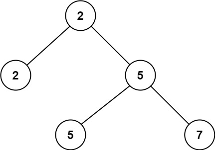
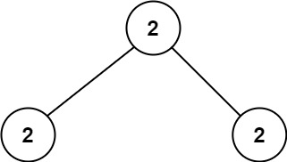

# 671. Second Minimum Node In a Binary Tree


## Level - easy


## Task
Given a non-empty special binary tree consisting of nodes with the non-negative value, 
where each node in this tree has exactly two or zero sub-node. 
If the node has two sub-nodes, then this node's value is the smaller value among its two sub-nodes. 
More formally, the property root.val = min(root.left.val, root.right.val) always holds.

Given such a binary tree, you need to output the second minimum value in the set made of all the nodes' value in the whole tree.

If no such second minimum value exists, output -1 instead.


## Объяснение
Задача состоит в том, чтобы найти в двоичном дереве второе минимальное значение. 
В двоичном дереве каждый узел имеет не более двух дочерних узлов.

Минимальное значение в дереве - это значение самого левого узла. 
Второе минимальное значение - это значение следующего по значению узла, 
который не является левым дочерним узлом самого левого узла.

Для решения этой задачи можно использовать рекурсивный подход. Начните с корня дерева.
Если корень имеет значение, равное минимальному значению, то перейдите к левому дочернему узлу.
Если левого дочернего узла нет, то текущий узел является вторым минимальным значением.
Если левое дочернее значение равно минимальному значению, то перейдите к правому дочернему узлу.
Если правого дочернего узла нет, то текущий узел является вторым минимальным значением.
Если правое дочернее значение равно минимальному значению, то текущий узел является вторым минимальным значением.

Если корень не является минимальным значением, то второе минимальное значение - это минимальное значение левого дочернего узла или правого дочернего узла.


## Example 1:

````
Input: root = [2,2,5,null,null,5,7]
Output: 5
Explanation: The smallest value is 2, the second smallest value is 5.
````


## Example 2:

````
Input: root = [2,2,2]
Output: -1
Explanation: The smallest value is 2, but there isn't any second smallest value.
````


## Constraints:
- The number of nodes in the tree is in the range [1, 25].
- 1 <= Node.val <= 2^31 - 1
- root.val == min(root.left.val, root.right.val) for each internal node of the tree.