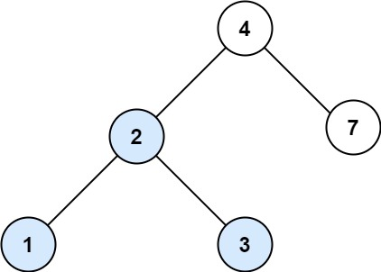

# 700. Search in a Binary Search Tree


## Level - easy


## Task
You are given the root of a binary search tree (BST) and an integer val.

Find the node in the BST that the node's value equals val and return the subtree rooted with that node. If such a node does not exist, return null.


## Объяснение
Задача требует написать функцию, которая будет осуществлять поиск в двоичном дереве поиска (Binary Search Tree, BST).

Функция должна принимать два аргумента: root - корень дерева, val - значение, которое нужно найти. 
Если значение найдено, функция должна вернуть узел дерева, содержащий это значение. Если значение не найдено, функция должна вернуть nil.

## Example 1:

````
Input: root = [4,2,7,1,3], val = 2
Output: [2,1,3]
````


## Example 2:

````
Input: root = [4,2,7,1,3], val = 5
Output: []
````


## Constraints:
- The number of nodes in the tree is in the range [1, 5000].
- 1 <= Node.val <= 10^7
- root is a binary search tree.
- 1 <= val <= 10^7