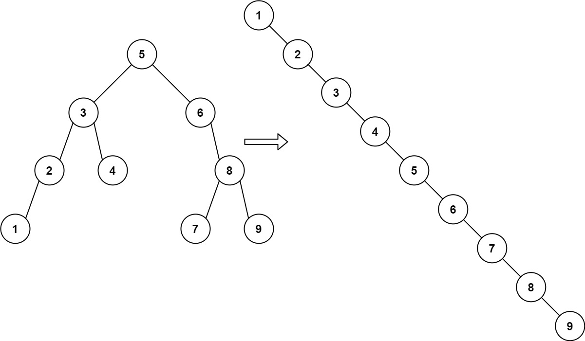

# 897. Increasing Order Search Tree


## Level - easy


## Task
Given the root of a binary search tree, rearrange the tree in in-order so that the leftmost node in the tree is now the root of the tree, 
and every node has no left child and only one right child.


## Объяснение
Задача заключается в том, чтобы преобразовать двоичное дерево поиска (BST) в другое дерево, которое также является BST, 
но в котором все значения узлов упорядочены по возрастанию.

Дерево BST - это дерево, в котором для каждого узла все значения в левом поддереве меньше значения узла, 
а все значения в правом поддереве больше значения узла.

Задача требует преобразовать дерево BST в другое дерево BST, в котором все значения узлов упорядочены по возрастанию.

Ваша задача - реализовать функцию, которая принимает на вход корень дерева BST и возвращает корень нового дерева BST, 
в котором все значения узлов упорядочены по возрастанию.


## Как лучше решать задачу?
Для решения этой задачи можно использовать два основных метода:
1. Индуктивное построение дерева: Вы можете пройти по дереву в порядке возрастания, сохраняя предыдущий узел и связывая его с текущим узлом. 
Этот метод эффективен, так как он позволяет построить дерево в одном проходе.

2. Преобразование в массив и обратное построение дерева: Вы можете сначала пройти по дереву в порядке возрастания и сохранить значения в массив. 
Затем, используя этот массив, вы можете построить новое дерево. Этот метод также эффективен, так как он позволяет построить дерево в одном проходе.


## Example 1:

````
Input: root = [5,3,6,2,4,null,8,1,null,null,null,7,9]
Output: [1,null,2,null,3,null,4,null,5,null,6,null,7,null,8,null,9]
````


## Example 2:

````
Input: root = [5,1,7]
Output: [1,null,5,null,7]
````


## Constraints:
- The number of nodes in the given tree will be in the range [1, 100].
- 0 <= Node.val <= 1000