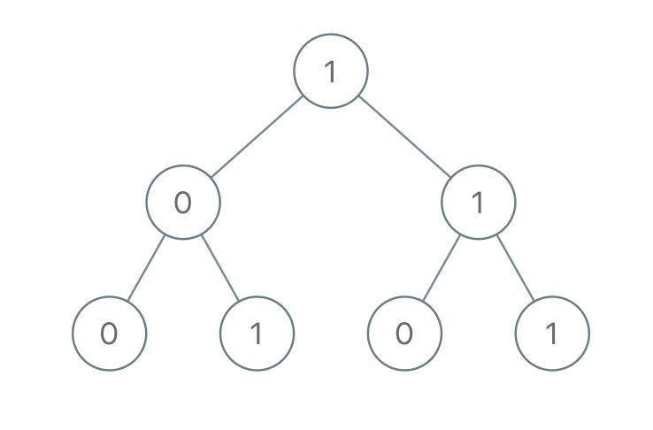

# 1022. Sum of Root To Leaf Binary Numbers


## Level - easy


## Task
You are given the root of a binary tree where each node has a value 0 or 1. 
- For example, if the path is 0 -> 1 -> 1 -> 0 -> 1, then this could represent 01101 in binary, which is 13.

For all leaves in the tree, consider the numbers represented by the path from the root to that leaf. 
Return the sum of these numbers.

The test cases are generated so that the answer fits in a 32-bits integer.


## Объяснение
Задача заключается в нахождении суммы всех путей от корня до листовых узлов в бинарном дереве.

Каждый узел в дереве содержит значение 0 или 1. 
Путь от корня до листового узла - это последовательность узлов, где каждый узел является потомком предыдущего узла, 
кроме последнего, который является листовым узлом.

Например, если мы имеем дерево:
````
     1
    / \
   0   1
  / \
 0   1
 ````

Тогда сумма путей от корня до листовых узлов будет равна 100 (100) + 101 (101) + 110 (6) + 111 (7) = 224.

Задача требует написать функцию, которая будет принимать корень бинарного дерева 
и возвращать сумму всех путей от корня до листовых узлов.

## Example 1:

````
Input: root = [1,0,1,0,1,0,1]
Output: 22
Explanation: (100) + (101) + (110) + (111) = 4 + 5 + 6 + 7 = 22
````


## Example 2:
````
Input: root = [0]
Output: 0
````


## Constraints:
- The number of nodes in the tree is in the range [1, 1000].
- Node.val is 0 or 1.