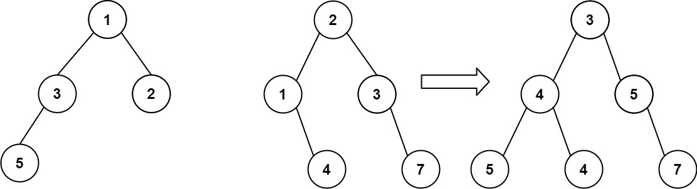

# 617. Merge Two Binary Trees


## Level - easy


## Task
You are given two binary trees root1 and root2.

Imagine that when you put one of them to cover the other, some nodes of the two trees are overlapped while the others are not. 
You need to merge the two trees into a new binary tree. 
The merge rule is that if two nodes overlap, then sum node values up as the new value of the merged node. 
Otherwise, the NOT null node will be used as the node of the new tree.

Return the merged tree.

Note: The merging process must start from the root nodes of both trees.


## Объяснение
Задача предлагает объединить два бинарных дерева в одно. 
Каждое дерево представляет собой структуру с узлами, которые имеют значение и ссылки на левого и правого потомков.
Цель задачи - реализовать этот алгоритм объединения двух бинарных деревьев.

Объединение деревьев должно быть выполнено следующим образом:
1. Если оба дерева не пусты, то создается новый узел, значение которого равно сумме значений корневых узлов обоих деревьев. Левое и правое поддерево нового узла получаются рекурсивным вызовом функции для левого и правого поддеревьев соответствующих узлов в обоих деревьях.
2. Если одно из деревьев пусто, то новый узел получается копией непустого дерева.
3. Если оба дерева пусты, то результат объединения также будет пустым деревом.

## Example 1:

````
Input: root1 = [1,3,2,5], root2 = [2,1,3,null,4,null,7]
Output: [3,4,5,5,4,null,7]
````


## Example 2:
````
Input: root1 = [1], root2 = [1,2]
Output: [2,2]
````


## Constraints:
- The number of nodes in both trees is in the range [0, 2000].
- -10^4 <= Node.val <= 10^4