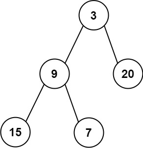

# 637. Average of Levels in Binary Tree


## Level - easy


## Task
Given the root of a binary tree, return the average value of the nodes on each level in the form of an array. 
Answers within 10-5 of the actual answer will be accepted.


## Объяснение
Задача предполагает нахождение среднего значения по каждому уровню в двоичном дереве.

Двоичное дерево - это структура данных, в которой каждый узел имеет не более двух дочерних узлов, 
называемых левым и правым дочерним узлами. В двоичном дереве узлы упорядочены таким образом, 
что значение левого дочернего узла меньше значения родительского узла, а значение правого дочернего узла больше.

Задача состоит в том, чтобы найти среднее значение всех узлов на каждом уровне дерева. Например, если у нас есть дерево
````
    3
   / \
  9  20
    /  \
   15   7
````

Среднее значение на первом уровне (узел 3) будет 3, на втором уровне (узлы 9 и 20) - 14.5, 
а на третьем уровне (узлы 15 и 7) - 11.5.

Решение этой задачи может быть реализовано с использованием различных алгоритмов обхода дерева, 
таких как обход в ширину (BFS) или обход в глубину (DFS).


## Example 1:

````
Input: root = [3,9,20,null,null,15,7]
Output: [3.00000,14.50000,11.00000]
Explanation: The average value of nodes on level 0 is 3, on level 1 is 14.5, and on level 2 is 11.
Hence return [3, 14.5, 11].
````


## Example 2:

````
Input: root = [3,9,20,15,7]
Output: [3.00000,14.50000,11.00000]
````


## Constraints:
- The number of nodes in the tree is in the range [1, 10^4].
- -2^31 <= Node.val <= 2^31 - 1