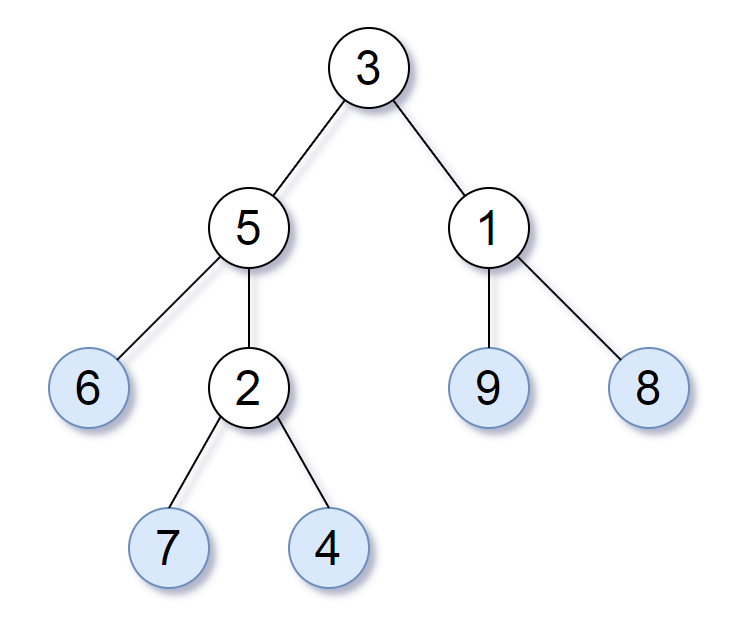
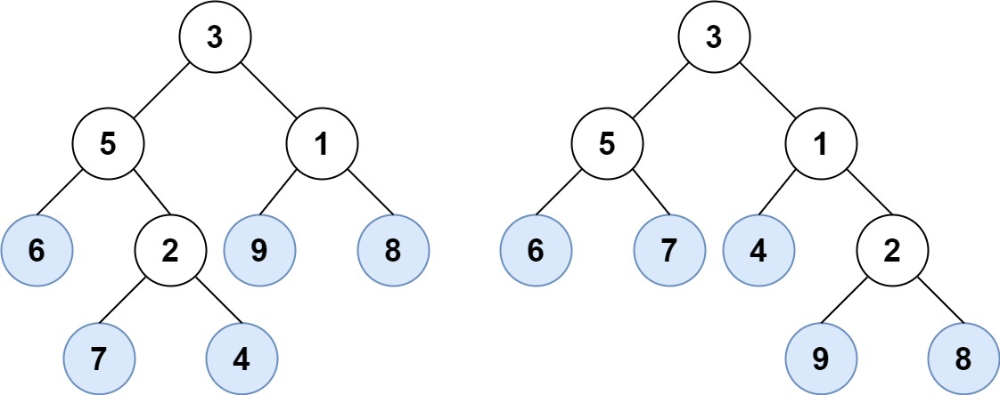
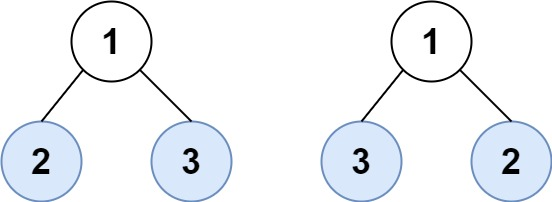

# 872. Leaf-Similar Trees


## Level - easy


## Task
Consider all the leaves of a binary tree, from left to right order, the values of those leaves form a leaf value sequence.



For example, in the given tree above, the leaf value sequence is (6, 7, 4, 9, 8).

Two binary trees are considered leaf-similar if their leaf value sequence is the same.

Return true if and only if the two given trees with head nodes root1 and root2 are leaf-similar.


## Объяснение
Задача предлагает сравнить две бинарные деревья по листьям (листьями дерева называются узлы, не имеющие дочерних узлов). 
Два дерева считаются "leaf-similar", если последовательность листьев обоих деревьев одинакова.

Для решения этой задачи нам нужно будет реализовать две функции:
1. Функцию dfs (глубокий поиск в глубину), которая будет обходить дерево и собирать листья в порядке обхода.
2. Функцию leafSimilar, которая будет использовать dfs для двух деревьев и сравнивать их листья.

Функция dfs будет рекурсивно обходить дерево, добавляя листья в список, когда они будут найдены. 
Функция leafSimilar будет использовать dfs для двух деревьев и сравнивать их листья. 
Если листья совпадают, функция вернет true, иначе - false.


## Example 1:

````
Input: root1 = [3,5,1,6,2,9,8,null,null,7,4], root2 = [3,5,1,6,7,4,2,null,null,null,null,null,null,9,8]
Output: true
````


## Example 2:

````
Input: root1 = [1,2,3], root2 = [1,3,2]
Output: false
````


## Constraints:
- The number of nodes in each tree will be in the range [1, 200].
- Both of the given trees will have values in the range [0, 200].