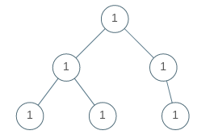
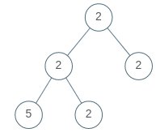

# 965. Univalued Binary Tree


## Level - easy


## Task
A binary tree is uni-valued if every node in the tree has the same value.

Given the root of a binary tree, return true if the given tree is uni-valued, or false otherwise.


## Объяснение

Задача "965. Univalued Binary Tree" - это задача на проверку свойства бинарного дерева. 
В этой задаче вам нужно определить, является ли дерево бинарным и все ли его узлы имеют одинаковое значение.

Дерево бинарным называется структура данных, в которой каждый узел имеет не более двух дочерних узлов, 
обычно называемых левым и правым дочерними узлами.

В задаче требуется реализовать функцию, которая будет проверять, 
является ли дерево бинарным и все его узлы имеют одинаковое значение. 
Если все узлы дерева имеют одинаковое значение, функция должна вернуть true, иначе - false.

Пример:
````
Input: [1,1,1,1,1,null,1]
Output: true
````

В этом примере все узлы дерева имеют значение 1, поэтому функция должна вернуть true.
````
Input: [2,2,2,5,2]
Output: false
````
В этом примере не все узлы дерева имеют значение 2, поэтому функция должна вернуть false.


## Example 1:

````
Input: root = [1,1,1,1,1,null,1]
Output: true
````


## Example 2:

````
Input: root = [2,2,2,5,2]
Output: false
````


## Constraints:
- The number of nodes in the tree is in the range [1, 100].
- 0 <= Node.val < 100