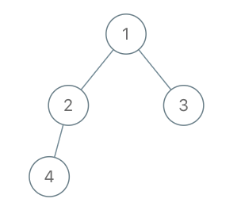
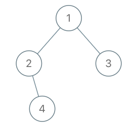

# 993. Cousins in Binary Tree


## Level - easy


## Task
Given the root of a binary tree with unique values and the values of two different nodes of the tree x and y, 
return true if the nodes corresponding to the values x and y in the tree are cousins, or false otherwise.

Two nodes of a binary tree are cousins if they have the same depth with different parents.

Note that in a binary tree, the root node is at the depth 0, and children of each depth k node are at the depth k + 1.


## Объяснение
Задача заключается в поиске двойников в бинарном дереве поиска. 
Двойник - это узел, который имеет одного и того же родителя, что и указанный узел, 
но находится на одном уровне (то есть на одном расстоянии от корня).

Для решения этой задачи вам понадобится знать, как работает бинарное дерево поиска, и понимание, как вычислять расстояния узлов от корня. 
Вы можете решить эту задачу, используя обход в глубину (DFS) или в ширину (BFS) для обхода дерева и поиска указанного узла и его двойников.

Однако, если вы хотите решить эту задачу с помощью обхода в ширину, 
вам нужно будет отслеживать уровень каждого узла и родителя узла, который вы ищете. 
Если вы находите узел, который имеет одного и того же родителя, что и узел, который вы ищете, 
и он находится на одном уровне, то вы нашли двойника.


## Example 1:

````
Input: root = [1,2,3,4], x = 4, y = 3
Output: false
````


## Example 2:
````
Input: root = [1,2,3,null,4,null,5], x = 5, y = 4
Output: true
````


## Example 3:

````
Input: root = [1,2,3,null,4], x = 2, y = 3
Output: false
````


## Constraints:
- The number of nodes in the tree is in the range [2, 100].
- 1 <= Node.val <= 100
- Each node has a unique value.
- x != y
- x and y are exist in the tree.