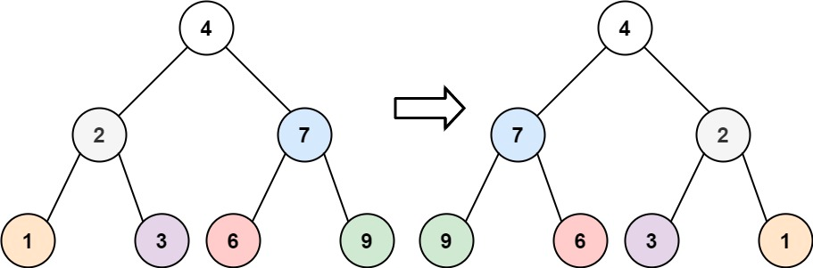
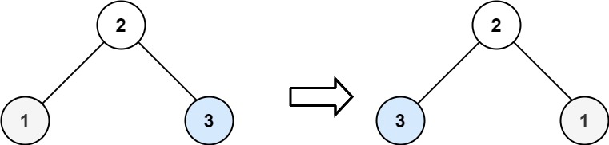

# 226. Invert Binary Tree


## Task level - easy


## Task
Given the root of a binary tree, invert the tree, and return its root.


## Суть задачи.
Надо просто поменять местами у каждой ноды left и right листья/ноды.

## Example-1

````
Input: root = [4,2,7,1,3,6,9]
Output: [4,7,2,9,6,3,1]
````


## Example-2

````
Input: root = [2,1,3]
Output: [2,3,1]
````


## Example-3
````
Input: root = []
Output: []
````