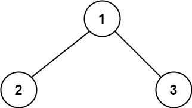
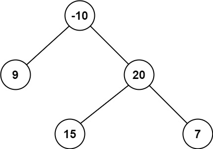

# 124. Binary Tree Maximum Path Sum


## Level - hard


## Task
A path in a binary tree is a sequence of nodes where each pair of adjacent nodes in the sequence has an edge connecting them. 
A node can only appear in the sequence at most once. Note that the path does not need to pass through the root.

The path sum of a path is the sum of the node's values in the path.

Given the root of a binary tree, return the maximum path sum of any non-empty path.


## Объяснение
Задача заключается в нахождении максимальной суммы пути в двоичном дереве. 
Путь в дереве - это последовательность узлов, где каждый узел имеет ровно одного родителя, 
кроме корня, который не имеет родителя.

Максимальная сумма пути определяется как максимальная сумма значений узлов на любом пути от одного узла до другого. 
Путь может начинаться и заканчиваться в любом узле, но он должен проходить через ровно один узел.
````
      1
     / \
    2   3
````

Максимальная сумма пути здесь будет 6 (1 + 2 + 3), потому что сумма значений узлов на пути 2 -> 1 -> 3 -> 1.

Задача требует реализации алгоритма, который будет находить максимальную сумму пути в любом двоичном дереве.


## Example 1:

````
Input: root = [1,2,3]
Output: 6
Explanation: The optimal path is 2 -> 1 -> 3 with a path sum of 2 + 1 + 3 = 6.
````


## Example 2:

````
Input: root = [-10,9,20,null,null,15,7]
Output: 42
Explanation: The optimal path is 15 -> 20 -> 7 with a path sum of 15 + 20 + 7 = 42.
````


## Constraints:

- The number of nodes in the tree is in the range [1, 3 * 10^4].
- -1000 <= Node.val <= 1000