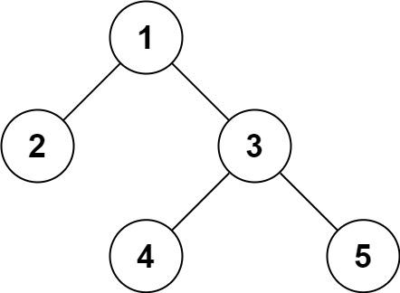

# 297. Serialize and Deserialize Binary Tree


## Level - hard


## Task
Serialization is the process of converting a data structure or object into a sequence of bits so that it can be stored in a file or memory buffer, 
or transmitted across a network connection link to be reconstructed later in the same or another computer environment.

Design an algorithm to serialize and deserialize a binary tree. 
There is no restriction on how your serialization/deserialization algorithm should work. 
You just need to ensure that a binary tree can be serialized to a string and this string can be deserialized to the original tree structure.

Clarification: The input/output format is the same as how LeetCode serializes a binary tree. 
You do not necessarily need to follow this format, so please be creative and come up with different approaches yourself.


## Объяснение
Задача требует от нас разработать два метода для работы с бинарным деревом:
- Сериализация (Serialize): Преобразование бинарного дерева в строку.
- Десериализация (Deserialize): Восстановление бинарного дерева из строки.

Сериализация (Serialize):
- Мы должны преобразовать бинарное дерево в строку таким образом, чтобы его можно было восстановить в исходное дерево.
- Обычно для этого используются различные обходы дерева, такие как порядковый (in-order), предварительный (pre-order), 
или последовательный (post-order).
- В данной задаче часто используется предварительный обход (pre-order), так как он позволяет легко восстановить дерево.
- Во время обхода, если мы встречаем пустой узел (null), мы также должны добавлять специальный символ (например, "null" или "N") в строку, 
чтобы обозначить его.

Десериализация (Deserialize):
- Мы должны восстановить бинарное дерево из строки, которая была создана в процессе сериализации.
- Используя предварительный обход (pre-order), мы можем легко восстановить дерево, так как первый элемент в строке всегда будет корнем дерева.
- Мы будем использовать очередь (queue) или стек (stack) для хранения узлов и их дочерних узлов, чтобы правильно восстановить структуру дерева.

Пример:
Рассмотрим следующее бинарное дерево:
````
    1
   / \
  2   3
     / \
    4   5
````

При предварительном обходе (pre-order) мы получим следующую строку:
"1,2,null,null,3,4,null,null,5,null,null"

## Example 1:

````
Input: root = [1,2,3,null,null,4,5]
Output: [1,2,3,null,null,4,5]
````


## Example 2:
````
Input: root = []
Output: []
````


## Constraints:
- The number of nodes in the tree is in the range [0, 10^4].
- -1000 <= Node.val <= 1000