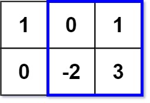

# 363. Max Sum of Rectangle No Larger Than K


## Level - medium


## Task
Given an m x n matrix matrix and an integer k, return the max sum of a rectangle in the matrix such that its sum is no larger than k.

It is guaranteed that there will be a rectangle with a sum no larger than k.


## Объяснение
Задача требует от нас найти максимальную сумму подматрицы (прямоугольника) в заданной матрице, 
где сумма элементов этой подматрицы не превышает заданного значения k.

Шаги:
- Предварительные вычисления. Для каждой строки матрицы вычисляем префиксные суммы. Это позволит быстро находить сумму элементов в любом подпрямоугольнике, ограниченном строками.
- Объединение столбцов. Для каждой пары столбцов (left, right) мы создаем временный массив, который будет хранить суммы элементов между этими столбцами для каждой строки.
- Поиск максимальной суммы не превышающей k. Для каждого такого временного массива мы ищем максимальную сумму подмассива, которая не превышает k.
- Обновление результата. Если найденная сумма больше текущего максимума, обновляем результат.

## Example 1:

````
Input: matrix = [[1,0,1],[0,-2,3]], k = 2
Output: 2
Explanation: Because the sum of the blue rectangle [[0, 1], [-2, 3]] is 2, and 2 is the max number no larger than k (k = 2).
````


## Example 2:
````
Input: matrix = [[2,2,-1]], k = 3
Output: 3
````


## Constraints:
- m == matrix.length
- n == matrix[i].length
- 1 <= m, n <= 100
- -100 <= matrix[i][j] <= 100
- -10^5 <= k <= 10^5