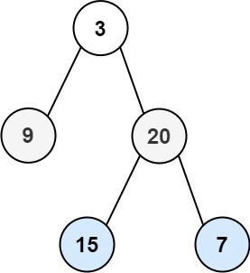

# 102. Binary Tree Level Order Traversal


## Level - medium


## Task
Given the root of a binary tree, return the level order traversal of its nodes' values. (i.e., from left to right, level by level).


## Объяснение
Задача заключается в том, чтобы обойти двоичное дерево уровней в порядке слева направо и верхнего внизу. 
Это означает, что вы должны пройти по каждому уровню дерева слева направо, начиная с корня, 
затем перейти на следующий уровень и продолжить процесс до самого нижнего уровня.

Для решения этой задачи вам понадобится использовать алгоритм обхода в ширину (BFS), 
так как он позволяет обойти дерево по уровням. В BFS мы используем очередь для отслеживания узлов, 
которые нужно посетить. На каждом шаге мы добавляем в очередь всех детей текущего узла, а затем удаляем его из очереди.

Шаги:
1. Проверьте, что корень не является нулевым. Если это так, верните пустой список.
2. Инициализируйте очередь и добавьте корень в нее.
3. Пока очередь не пуста, выполните следующие шаги:
3.1. Получите размер текущей очереди (количество узлов на текущем уровне).
3.2. Для каждого узла на текущем уровне:
3.2.1. Добавьте значение узла в список текущего уровня.  
3.2.2. Если у узла есть левый потомок, добавьте его в очередь.   
3.2.3. Если у узла есть правый потомок, добавьте его в очередь.  
3.3. Добавьте список текущего уровня в результирующий список.  
4. После выхода из цикла верните результирующий список.

## Example 1:

````
Input: root = [3,9,20,null,null,15,7]
Output: [[3],[9,20],[15,7]]
````


## Example 2:
````
Input: root = [1]
Output: [[1]]
````


## Constraints:
- The number of nodes in the tree is in the range [0, 2000].
- -1000 <= Node.val <= 1000