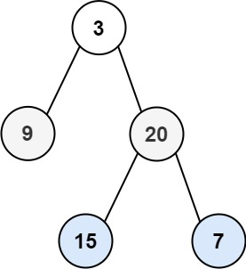

# 103. Binary Tree Zigzag Level Order Traversal


## Level - medium


## Task
Given the root of a binary tree, return the zigzag level order traversal of its nodes' values. 
(i.e., from left to right, then right to left for the next level and alternate between).


## Объяснение
Задача заключается в том, чтобы обойти двоичное дерево в порядке "змейки" или "наклонной змейки", 
т.е. слева направо, затем справа налево, потом снова слева направо и т.д. для каждого уровня дерева.

Например, если у нас есть дерево:
````
    3
   / \
  9  20
    /  \
   15   7
````

То результатом будет:
````
[
  [3],
  [20,9],
  [15,7]
]
````

## Example 1:

````
Input: root = [3,9,20,null,null,15,7]
Output: [[3],[20,9],[15,7]]
````


## Example 2:
````
Input: root = [1]
Output: [[1]]
````


## Example 3:
````
Input: root = []
Output: []
````


## Constraints:
- The number of nodes in the tree is in the range [0, 2000].
- -100 <= Node.val <= 100