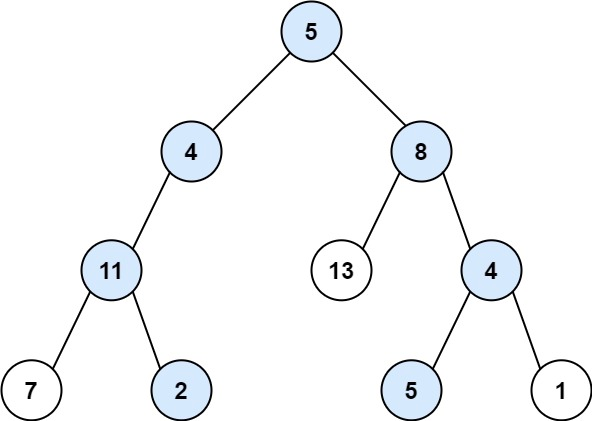

# 113. Path Sum II

## Task
Given the root of a binary tree and an integer targetSum, return all root-to-leaf paths where the sum of the node values in the path equals targetSum. 
Each path should be returned as a list of the node values, not node references.

A root-to-leaf path is a path starting from the root and ending at any leaf node. A leaf is a node with no children.

## Суть задачи
Дано бинарное дерево, точнее нам дается его вершина(root) и число - targetSum. Надо проверить присутствует ли в дереве
путь, длина которого равна числу targetSum и вернуть массивы этих путей.

## Example 1:

``
Input: root = [5,4,8,11,null,13,4,7,2,null,null,5,1], targetSum = 22
Output: [[5,4,11,2],[5,8,4,5]]
Explanation: There are two paths whose sum equals targetSum:
5 + 4 + 11 + 2 = 22
5 + 8 + 4 + 5 = 22
``

## Example 2:

``
Input: root = [1,2,3], targetSum = 5
Output: []
``

## Example 3:
``
Input: root = [1,2], targetSum = 0
Output: []
``