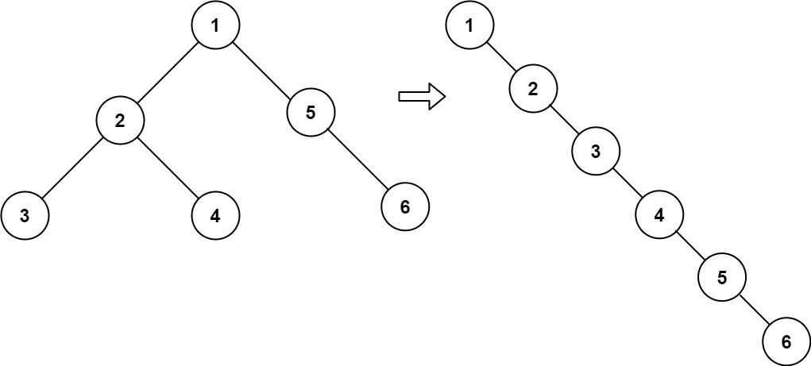

# 114. Flatten Binary Tree to Linked List


## Level - medium


## Task
Given the root of a binary tree, flatten the tree into a "linked list":
- The "linked list" should use the same TreeNode class where the right child pointer points to the next node in the list and the left child pointer is always null.
- The "linked list" should be in the same order as a pre-order traversal of the binary tree.


## Объяснение
Задача предлагает преобразовать двоичное дерево в связный список. 
Все узлы дерева должны быть упорядочены таким образом, что каждый узел не имеет левого потомка 
и правого потомка является следующим узлом в линейном порядке.

Пример:
- Вход
  1
  / \
  2   5
  / \   \
  3   4   6

- Выход
  1
  \
  2
  \
  3
  \
  4
  \
  5
  \
  6

## Example 1:

````
Input: root = [1,2,5,3,4,null,6]
Output: [1,null,2,null,3,null,4,null,5,null,6]
````


## Example 2:
````
Input: root = []
Output: []
````


## Example 3:
````
Input: root = [0]
Output: [0]
````


## Constraints:
- The number of nodes in the tree is in the range [0, 2000].
- -100 <= Node.val <= 100


Follow up: Can you flatten the tree in-place (with O(1) extra space)?