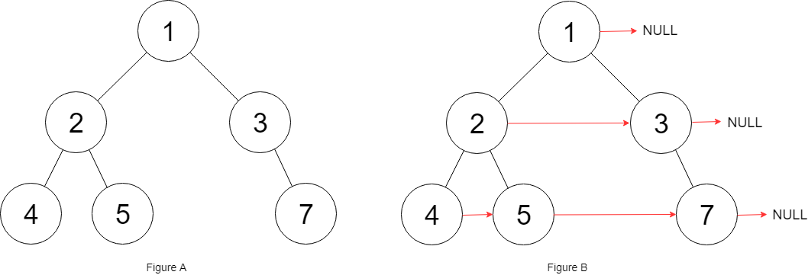

# 117. Populating Next Right Pointers in Each Node II


## Level - medium


## Task
Given a binary tree
````
struct Node {
int val;
Node *left;
Node *right;
Node *next;
}
````

Populate each next pointer to point to its next right node. 
If there is no next right node, the next pointer should be set to NULL.

Initially, all next pointers are set to NULL.


## Объяснение
Задача заключается в том, чтобы заполнить указатели next для каждого узла в неполном бинарном дереве таким образом, 
чтобы каждый узел указывал на следующий узел на том же уровне. Если узел является последним на своем уровне, 
его указатель next должен быть установлен в null.

Вход:
- Корень неполного бинарного дерева.

Выход:
- Дерево, в котором каждый узел имеет правильно установленный указатель next.

Пример:
````
       1
     /   \
    2     3
   / \     \
  4   5     7
````

После выполнения функции дерево должно выглядеть так:
````
       1 -> null
     /   \
    2  -> 3 -> null
   / \     \
  4-> 5  -> 7 -> null
````

Решение этой задачи может быть реализовано с использованием различных подходов, включая обход дерева в ширину (BFS) или рекурсивные методы. 
Основная идея заключается в том, чтобы для каждого уровня дерева установить правильные указатели next для всех узлов на этом уровне.


## Example 1:

````
Input: root = [1,2,3,4,5,null,7]
Output: [1,#,2,3,#,4,5,7,#]
Explanation: Given the above binary tree (Figure A), your function should populate each next pointer to point to its next right node, just like in Figure B. 
The serialized output is in level order as connected by the next pointers, with '#' signifying the end of each level.
````


## Example 2:
````
Input: root = []
Output: []
````


## Constraints:
- The number of nodes in the tree is in the range [0, 6000].
- -100 <= Node.val <= 100


## Follow-up:
- You may only use constant extra space.
- The recursive approach is fine. You may assume implicit stack space does not count as extra space for this problem.