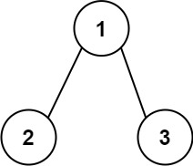
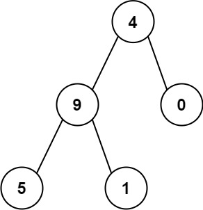

# 129. Sum Root to Leaf Numbers


## Level - medium


## Task
You are given the root of a binary tree containing digits from 0 to 9 only.

Each root-to-leaf path in the tree represents a number.
- For example, the root-to-leaf path 1 -> 2 -> 3 represents the number 123.

Return the total sum of all root-to-leaf numbers. 
Test cases are generated so that the answer will fit in a 32-bit integer.

A leaf node is a node with no children.


## Объяснение
Задача заключается в нахождении суммы всех чисел, которые образуются путем обхода от корня до листьев в бинарном дереве.

Каждое число формируется путем объединения значений узлов на пути от корня до листа. 
Например, если у вас есть бинарное дерево, представленное в виде [1,2,3], то сумма чисел, которые можно получить, 
будет равна 12 + 13 = 25.

Таким образом, задача сводится к обходу всего дерева и вычислению суммы чисел, 
которые получаются путем объединения значений узлов.


## Example 1:

````
Input: root = [1,2,3]
Output: 25
Explanation:
The root-to-leaf path 1->2 represents the number 12.
The root-to-leaf path 1->3 represents the number 13.
Therefore, sum = 12 + 13 = 25.
````


## Example 2:

````
Input: root = [4,9,0,5,1]
Output: 1026
Explanation:
The root-to-leaf path 4->9->5 represents the number 495.
The root-to-leaf path 4->9->1 represents the number 491.
The root-to-leaf path 4->0 represents the number 40.
Therefore, sum = 495 + 491 + 40 = 1026.
````


## Constraints:
- The number of nodes in the tree is in the range [1, 1000].
- 0 <= Node.val <= 9
- The depth of the tree will not exceed 10.