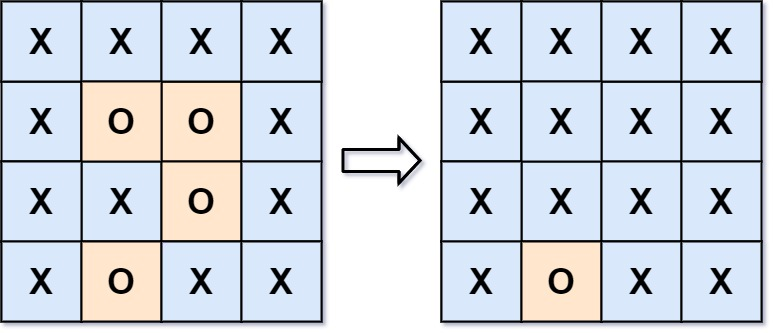

# 130. Surrounded Regions


## Level - medium


## Task
You are given an m x n matrix board containing letters 'X' and 'O', capture regions that are surrounded:
- Connect: A cell is connected to adjacent cells horizontally or vertically.
- Region: To form a region connect every 'O' cell.
- Surround: The region is surrounded with 'X' cells if you can connect the region with 'X' cells and none of the region cells are on the edge of the board.

A surrounded region is captured by replacing all 'O's with 'X's in the input matrix board.


## Объяснение
Задача "Surrounded Regions" (Окруженные регионы) из области компьютерного программирования и алгоритмов, в частности, 
связана с матрицами и поиском в графе.

Суть задачи:
Дана двумерная матрица, состоящая из символов 'X' и 'O'. 
Требуется заменить все 'O', которые полностью окружены 'X' в матрице, на 'X'. 
Однако, 'O', которые находятся на границах матрицы или соединены с 'O' на границе, не должны быть заменены.

Пример:
````
Входная матрица.
X X X X
X O O X
X X O X
X O X X
````

````
Выходная матрица.
X X X X
X X X X
X X X X
X O X X
````

## Example 1:
````
Input: board = [["X","X","X","X"],["X","O","O","X"],["X","X","O","X"],["X","O","X","X"]]
Output: [["X","X","X","X"],["X","X","X","X"],["X","X","X","X"],["X","O","X","X"]]
Explanation:
````


In the above diagram, the bottom region is not captured because it is on the edge of the board and cannot be surrounded.


## Example 2:
````
Input: board = [["X"]]
Output: [["X"]]
````


## Constraints:
- m == board.length
- n == board[i].length
- 1 <= m, n <= 200
- board[i][j] is 'X' or 'O'.